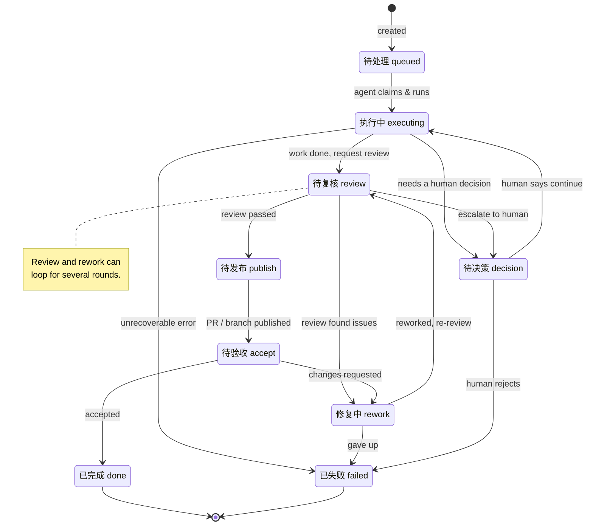
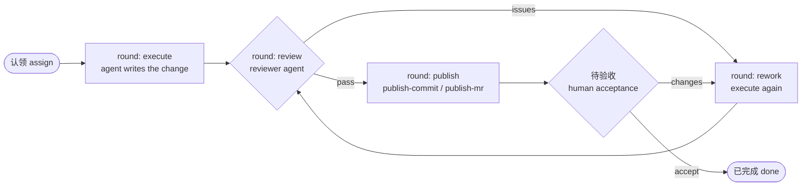

# Agent Task Loop — workflow

Agent Task Loop drives a task from assignment to a publish-ready handoff. A task
moves through a fixed set of statuses; coding agents pick up **rounds** of work
(execute / review / rework / publish), each recorded in the task's session
history as its own agent session.

## Task status lifecycle

The store holds one status per task. Statuses (the Chinese labels are the source
of truth in `TASK_STATUSES`) advance like this:

**Buckets** (how the dashboard tabs group them):

| Bucket | Statuses |
| --- | --- |
| Active (running + queued) | 待处理 · 进行中 · 执行中 · 待复核 · 修复中 · 待发布 |
| Needs Input | 待决策 · 待验收 |
| Done | 已完成 · 已失败 |

## Agent rounds (per task)

Each status transition above is driven by an agent **round**. A task accumulates
rounds across its life; every round is its own session (with its own transcript),
appended to `SessionHistory` as `round=N | kind=… | agent=… | id=…`.

Observed round kinds in real data: `execute`, `review`, `publish-commit`,
`publish-mr`.

## Where to see it

- **`agent-task-loop tui`** — the interactive dashboard. The session-preview pane
  lists a task's rounds (history mode); press `Enter` on a round to read that
  round's full agent **transcript**.
- **Session history** is stored on each task and parsed back into the timeline
  the dashboard shows.
