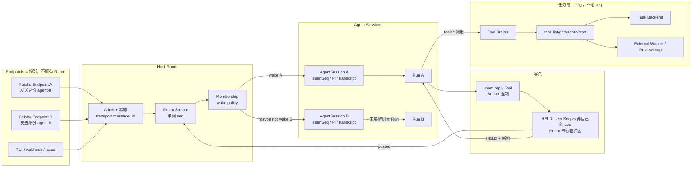
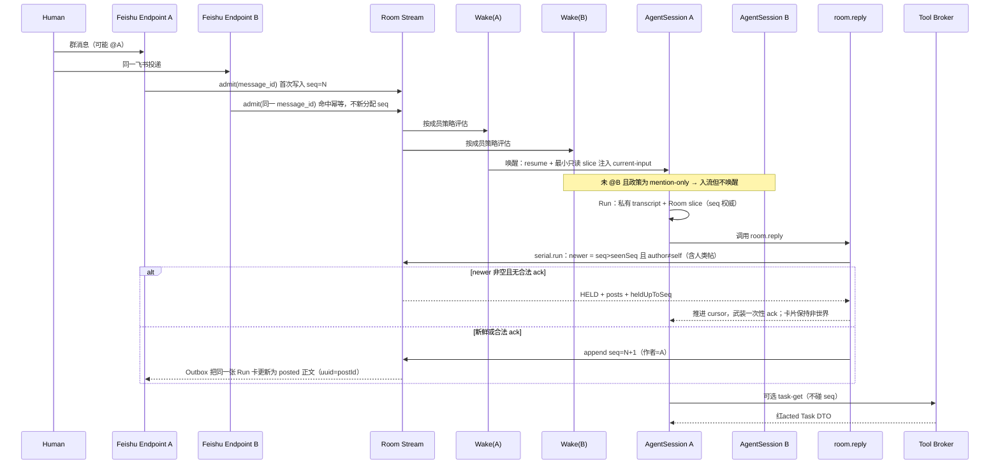

# RFC 0010: Rivus Host 世界模型：抽象 Room、Agent Session 与 Run

| 字段 | 值 |
| --- | --- |
| 状态 | Draft |
| 日期 | 2026-08-24 |
| 作者 | PerfectPan / Rivus |
| 类型 | Host 世界模型设计（本仓库记录方向；Host 实现在 `rivus-agent`） |
| 后续落点 | Host 侧更新 `rivus-agent` 的 `rfcs/0002-multi-agent-host-and-capability-isolation.md`；本仓库任务挂钩保持 [RFC 0009](./0009-rivus-task-manager-plugin.md) |
| 非落点 | 不把 TaskRecord / Task Run / External Worker 写入 Room；不在本设计中实现 `task-start` CAS |

本文件是 Host 世界模型的设计记录，落在本仓库是为了与 RFC 0009 的任务边界放在一起。它会改写 `rivus-agent` RFC 0002 中把「一个飞书 Chat」拆成 N 个互不可见世界的绑定键与群聊路由，但**不静默覆盖** RFC 0002 的能力隔离、Tool Broker、Peer Delegation、Subagent 与 Memory 边界。任务域继续作为既有 Plugin（本仓库 RFC 0009）挂在 Host 上。本仓库不实现 Room store。

---

## Overview

当前 Rivus 把传输身份、Agent 身份和会话连续性绑在同一把钥匙上。RFC 0002 的 `ConversationBindingKey = TenantId + SessionNamespace + AgentId + ConversationId`，配合 `src/application/feishu/feishu-session-key.ts` 在 ConversationId 后再拼 `agentId`、`src/composition/feishu-deployment-endpoint.ts` 的 `namespaceSessionKey` 再前缀 Endpoint `sessionNamespace`，使同一飞书群在两个 Bot 下成为两段互不看见的历史。`src/application/feishu/feishu-group-policy.ts` 则在 Mention 路由前直接丢弃 bot/app 发送者，把「同伴发帖」从世界上抹掉。

本设计把世界模型拆成三层、并与任务域隔离：

- **Room**（`TenantId + ConversationId`）是抽象的已发布事件流：单调 `seq`、成员、唤醒/入场策略。飞书群、Issue、TUI、webhook 都是投影，不是 Room 本身。
- **AgentSession**（`TenantId + AgentId + RoomId + RuntimeGenerationId`）是该 Agent 在这个世界里的连续性：seen cursor、Pi 绑定、私有 transcript、Conversation Memory、至多一个 Active Run。共享流是世界；Session 是「我在这个世界里已经想过什么」。二者不得塌缩。
- **Run** 挂在 AgentSession 上。RFC 0004 的 intake / 卡片 / `/cancel` 映射到 Session 上的 Run，而不是映射到 Room 或 Task。

Task Manager 仍是 RFC 0009 的 Plugin Profile。`task-list/get/create/start` 走 Tool Broker，**不读写 Room seq**。Task Run、workspace、External Worker 不是 Room 字段，也不是用户可 `@` 的顶层身份。先稳定 Host 基底，再挂钩任务。

---

## Key Decisions

1. **多 Agent 协调 ≠ 任务编排。** Room 负责共享已发布流与唤醒；Task Backend / Task Run / External Worker 留在 `agent-task-loop`。禁止用 Room 当任务队列、用 Task 当群聊身份。
2. **一等参与者共享同一条已发布流。** 成员 Agent 看见同一条 `seq` 流；各自决定是否发言；`@` 是寻址，不是「没被提到就看不见」。See ≠ wake。
3. **Session 强制保留。** 不得把 Room Stream 当成唯一 transcript，也不得把 Session 当成 N 个互不可见的世界。Room 赢在「已发布事实」；Session 赢在「我的推理连续性」。
4. **Room 是抽象域概念。** 不是飞书群、不是 Issue、不是某个 IM 窗口。Chat / Issue / topic / TUI / webhook 是 Endpoint 投影。
5. **先 Host 基底，再挂钩任务。** Core 不吸收看板、日历、私人 todo。Cumora 的产品形状不进 Core；只借鉴其 seen-cursor / HELD-ack 教训。
6. **Room 不是 Peer Delegation RPC。** 同伴发帖进入 Room Stream，不签发 `DelegationGrant`，不切换发送身份。Grant 仍是 `src/application/delegation/delegation-service.ts` 的 Host 边。
7. **聊天回合不用 claim；排他交付物才可以。** 新鲜度闸门在 send/reply **写点**，不是 Prompt 规则。聊天回合并行发言以 HELD + 重读解决。
8. **See ≠ wake。** 第一版：人类消息按成员唤醒策略唤醒；同伴 Agent 发帖入流且**默认不唤醒**。wake-on-peer-posts 预留配置旋钮、**默认关**，不是 Room 的定义，也不在 PR 2 实现。
9. **不增加 `task-claim` Tool。** `task-start` 的 inspect-then-run TOCTOU（`packages/agent-task-loop/src/task-manager/task-start-service.ts`）本设计不修；若以后修，是 runtime store 上对 `recordId` 的 CAS，独立变更。
10. **Subagent 从 Room 不可寻址、无发送身份。** 并行「围攻」走隔离 workspace / Subagent spawn（`src/application/delegation/subagent-coordinator.ts` 已将 `senderIdentity: false`），不是 21 个顶层身份各自决定下一句聊天。
11. **无限制 Shell 不是沙箱；不采用 Cumora 的胖 `cumora` CLI 作为模型面。** 模型面仍是 Broker allowlist 上的 Tool Schema。隔离继续靠 Broker，而不是 directory + JWT。
12. **Skill / `AGENTS.md` / Prompt 不能授予 Tool。** 交通规则不活在 markdown 里。写点闸门、唤醒策略、发送身份都是 Host 强制。
13. **飞书上人类可见的 Agent 正文有且仅有 `kind: "posted"` 的 Outbox 投影。** Run 卡片只承载进度 / 取消 / HELD 状态，不含可被同伴当作世界事实的正文。单 Bot Compatibility 包装谓词（三者同时）：`Grant 含 room.reply` **且** `本 Run 对 room.reply 的调用次数 == 0` **且** `finalText 非空`。一旦出现过 `held` 或 `posted`，**禁止**包装——合法沉默（含 HELD 后选择不发）不得把过期 `finalText` 发出去。
14. **无 Endpoint 的成员不能 `room.reply`（稳定错误，不发帖）。** 只读唤醒（Grant 无 `room.reply`）仍占用该 AgentSession 的一个 Active Run。Room slice **展示即推进 `seenSeq`**，与本次是否 posted 无关。聊天 `posted` 推进 seen；控制面投递**不**推进。
15. **该成员 Endpoint 发出的每一条飞书 `message_id` 都进 Endpoint Outbound Registry。** 回声永不新分配 seq。Automation / Background 的人类可见正文走 `origin: "control-plane"` 写点：占 seq、作者仍是成员 `AgentId`、登记 registry，但 **不走聊天 HELD、不消费 hold token、不推进该 AgentSession 的 `seenSeq`**。进度卡、审批卡、RFC 0011 CoT 登记为非世界展示。

---

## Background & Motivation

### 当前状态

RFC 0002（草案）已经正确隔离了 Profile、ToolGrantSet、Peer Delegation 与 Subagent，但它把「会话世界」定义成了传输绑定：

```text
ConversationBindingKey = TenantId + SessionNamespace + AgentId + ConversationId
EndpointInstanceKey    = ConversationBindingKey + RuntimeGenerationId
```

实现比 RFC 更窄、也更碎：

| 层 | 实际行为 | 文件 |
| --- | --- | --- |
| ConversationId | `feishu:{tenant}:{chat}:{thread}`，**不含** AgentId | `src/application/feishu/feishu-session-key.ts` `createFeishuConversationId` |
| Feishu SessionKey | ConversationId **再拼** `agentId` | 同文件 `createFeishuSessionKey` |
| Endpoint 前缀 | `{sessionNamespace}:{sessionKey}` | `src/composition/feishu-deployment-endpoint.ts` `namespaceSessionKey` |
| 群聊准入 | bot/app sender 直接 `return false`；未提及按 Endpoint `groupPolicy` | `src/application/feishu/feishu-group-policy.ts` |
| Instance 注册 | `bindingKey = endpoint:{endpointId}:{agentId}`，按 Endpoint 而非 Conversation | `src/application/host/agent-instance-registry.ts` |
| 双 Bot 示例 | 两个 Endpoint、两套 `sessionNamespace`、各 `mention-only` | `examples/rivus.config.json` |

同一飞书群里的 `agent-a` 与 `agent-b` 因此得到：

```text
feishu-agent-a-v1:feishu:{tenant}:{chat}:root:agent-a
feishu-agent-b-v1:feishu:{tenant}:{chat}:root:agent-b
```

两把钥匙、两段 transcript、两次独立唤醒、彼此看不见对方已经发布的内容。RFC 0002 非目标第 69 行「让机器人通过互相发送飞书消息来协作」与测试断言第 799–800 行把这个分裂写成了契约。

与此同时，任务域已经在另一个仓库以 Plugin 形式存在，且语言明确禁止混用（`agent-task-loop` 仓库 `CONTEXT.md`）：

> Task Run ≠ Rivus run ≠ chat session
> External Worker ≠ Rivus subagent
> Task Backend ≠ Rivus Memory

`packages/agent-task-loop/src/rivus-plugin.ts` 只注册四个 Tool：`agent-task-loop/task-list|get|create|start`。Profile 声明 `memory.scopes = []`，不拿 ambient Shell / fs / Endpoint。Host 若把 TaskRecord 塞进 Room，等于把 RFC 0009 的边界拆掉。

### 痛点

1. **世界被钥匙切碎。** 两个一等 Agent 无法读同一条已发布流，无法在写点上做新鲜度判断，只能靠 Prompt「假装看见群」。
2. **See 与 wake 绑死。** 当前 `shouldAcceptFeishuEndpointMessage` 在 Intake 前丢弃，未入流的事件既不能唤醒，也不能被稍后读到。
3. **同伴帖被当成循环威胁删掉。** bot/app 拒绝是为了防循环，但它也删除了世界里的同伴发言。正确做法是：帖是数据，Grant 是 Host 边，默认不唤醒。
4. **回复没有写点闸门。** 今天模型 `finalText` 经 `src/application/feishu/feishu-stream-projector.ts` 投影到飞书。没有 `seenSeq`，没有 HELD，没有一次一用的 ack。两名 Agent 会同时对着过期世界发言。
5. **任务域有渗入 Core 的压力。** 用 Room claim 修 `task-start` TOCTOU、把 Task Run 当成可 `@` 的 Session、把 workspace 当成 Room 字段，都会把两个状态机焊死。

### 先验（只借物理，不借产品）

公开项目 Cumora 证明了「共享 conversation seq + per-agent seen cursor + 写点 HELD」能降低并行发帖碰撞。可核对的机制（相对其仓库根）：

- `server/src/agents/seen-boundary.ts`：per-(agent, conversation) seen seq；hold token 必须绑定 `heldUpToSeq`；**flag 不能预跳闸门**。
- `server/src/agents/cli.ts` `cmdReply`：HELD 返回更新帖、推进 cursor、武装一次一用 ack；`--send-anyway` 只有先前 HOLD 武装的 token 才生效。
- `conversation_reads.last_read_at` 不能兼作 inbox cursor 与新鲜度边界。
- **compose-anchor 与 verbatim-dup 的时间线（勿写反）：** `seen-boundary.ts` 引入 compose-anchor，是因为 glance/`cumora messages` 会把 seen 推过同伴刚落地的帖，使写点误判「已读」而放行过期草稿。现行 `cli.ts` 又用 seen-cursor **替换** compose-anchor，因为「第一轮就 HELD 已经展示过的帖」太吵；glance 后仍发同一句的残留由 **verbatim-dup** 覆盖。Rivus **两样都不抄**：Host 自有 store 上对 Room 做串行 check-then-append，关掉并发 INSERT TOCTOU，故不需要 verbatim-dup；`seenSeq` 只允许在 wake slice / HELD envelope / posted 三处单调推进，Run 中禁止其它路径 `advanceSeen`（没有 glance Tool），故不需要 compose-anchor。

Cumora 的 fail-open 是因为 Redis **不是**真相源。Rivus 的 seq 由 Host 自有 store 分配，发送必须 fail-closed。Cumora 的胖 CLI、看板、日历、directory+JWT 计算机隔离**不进入 Core**。Room 不是派活收件箱：共享已发布流与执行 workspace、设备是三件不同的事。

---

## Goals & Non-Goals

### Goals

- 引入抽象 Room：共享已发布流、成员、唤醒策略；Endpoint 只投影，不拥有 Room。
- 强制 AgentSession：私有 transcript、seen cursor、Pi 绑定、Conversation Memory、一个 Active Run。
- 把 Run 挂在 AgentSession 上；RFC 0004 的 intake / 卡片 / 取消映射到该 Run。
- 重写绑定键，使同一规范化 `ConversationId` 分配一个 Room；旧 Feishu SessionNamespace 钥匙只读兼容。
- ContextAssembler 增加只读 Room Stream slice；发帖冲突以 Room 为权威；Compaction 仍只压一个 Instance。
- 在 send/reply 写点实施 HELD + 重读 + 绑定 `heldUpToSeq` 的一次一用 ack。
- 唤醒策略挂在 Room 成员上，不挂在 Endpoint 上。第一版只实现 `mention-only` 与 `all-human-messages`；同伴帖默认不唤醒。`topic-continue` 推迟到 chat 级 Room（见下方关闭后的粒度决策）。
- 以飞书为第一 Adapter 证明：两个 Agent、一条 Room seq、两个 Session、最小只读 slice 可见、reply 可 HELD、卡片不是第二条世界正文、Delegation 仍不走飞书。
- 第二阶段把 Task Manager Plugin 挂上新 Host，且 Room 不获得任何任务语义。

### Non-Goals

- 不设计聊天产品：看板、日历、私人 todo、投票、会签不进 Core。
- 不把 Room 当 Peer Delegation RPC，不用飞书机器人互发消息签发 Grant。
- 不让用户从 Room `@` Subagent，不给 Subagent 发送身份。
- 不增加 `task-claim` Tool，不在本设计中做 `task-start` CAS。
- 不把 TaskRecord、Task Run 状态机、workspace、External Worker、runnerPid 写入 Room Stream 或 AgentSession。
- 不采用 Cumora 胖 CLI 作为模型面；不把无限制 Shell 当作沙箱。
- 不让 Skill / `AGENTS.md` / Prompt 授予 Tool 或改唤醒策略。
- 不用 LLM 意图分类路由未提及消息（RFC 0002 非目标第 68 行保持）。
- 不在第一版实现 wake-on-peer-posts（配置旋钮预留、默认关；同伴帖仍入流）。
- 不把共享 Room 摘要当作权威；不跨 Instance 压缩。
- 不实现分布式多 Host、不在本 RFC 定最终外部配置文件格式。
- 不把 Companion Chain-of-Thought、tool trace、私有 transcript 写入 Room Stream。

---

## Proposed Design

### 分层

```text
Room          = TenantId + ConversationId
                共享已发布流 (seq)、成员、唤醒/入场策略
AgentSession  = TenantId + AgentId + RoomId + RuntimeGenerationId
                seen cursor、engine/Pi 绑定、私有 transcript、
                Conversation Memory、一个 Active Run
Run           = AgentRunId，挂在 AgentSession 上
Endpoint      = 某个 Room 在一种传输上的投影；不拥有 Room
Task*         = Task Manager Profile 背后的 Plugin 域；不是 Room 字段
```

身份补充（沿用 RFC 0002，不重建）：

| 标识 | 职责 | 不得承担 |
| --- | --- | --- |
| `RoomId` | 世界 | 发送身份、Task 主键、Pi 文件路径 |
| `AgentSessionId` | 该 Agent 在该世界的连续性 | 传输凭证、Grant |
| `AgentInstanceId` | Runtime 实例（恢复 Pi / Loader） | Room 成员名单 |
| `AgentRunId` | 一次被接受的尝试 | Task Run id |
| `EndpointId` | 传输与发送凭证 | Room 所有权、唤醒策略的家 |
| `SessionNamespace` | **仅**兼容旧 Feishu Session 文件别名 | 新 Room 主键 |

`ConversationId` 仍由适配器规范化且带传输类型，现有 `createFeishuConversationId` 已是正确形状（`feishu:{tenantKey}:{chatId}:{threadId}`）。Room 主键**去掉** `AgentId` 与 `SessionNamespace`。

**第一版飞书粒度（已决定）：** 一个 Feishu chat+thread 对应一个 Room，沿用今日 ConversationId。Room 列车稳定之后，再把 chat 升为 Room、thread 降为 topic；**只有那时**才引入零启发式 `topic-continue`（`thread_id != root`）。v1 不在 chat+thread Room 上实现该政策——thread 已在主键里，政策会退化为「曾在此 Room 发过言则永远唤醒」，且 root 上的「他人明确转向」是启发式，违反 RFC 0002 L68。

### 架构与数据流



要点：Task Manager Tool **只走 Broker**，不读不写 Room seq。Room 里可以出现人类说「去做 TASK-101」的帖——那是流数据。权威任务字段仍在 Task Backend。



### 绑定键改写

#### 现状泄漏

三处把传输和 Agent 写进了世界主键：

1. RFC 0002 第 176–181 行：`ConversationBindingKey` 含 `SessionNamespace + AgentId`。
2. `createFeishuSessionKey`：在已规范化 ConversationId 后追加 `agentId`。
3. `namespaceSessionKey`：再前缀 Endpoint 的 `sessionNamespace`（`examples/rivus.config.json` 里是 `feishu-agent-a-v1` / `feishu-agent-b-v1`）。

`SessionNamespace` 的本意（RFC 0002 第 143、740 行）是「重命名 Endpoint 不拆历史」，结果却把同一 Room 拆成按 Endpoint 隔离的世界。

实现中的 `AgentInstanceRegistry` 进一步把 Instance 绑在 `endpoint:{endpointId}:{agentId}` 上，**完全没有 Conversation**。会话隔离只靠 SessionKey 字符串。新模型必须把「世界」从字符串前缀里拿出来，变成一等存储。

#### 新键

```text
RoomId              = TenantId + ConversationId
                      不再 hash。ConversationId 已含传输类型且全局唯一
                      （feishu:{tenant}:{chat}:{thread}），hash 只会妨碍运维对照。

RoomMembershipKey   = RoomId + AgentId

AgentSessionKey     = TenantId + AgentId + RoomId + RuntimeGenerationId

EndpointInstanceKey = EndpointId + AgentId + RuntimeGenerationId
                      只用于 Endpoint 进程/凭证监管，不用于世界主键

LegacySessionAlias  = `${sessionNamespace}:${legacySessionKey}`
                      只读；解析到 AgentSessionKey
```

`RuntimeGenerationId` 与飞书 `/reset` generation **不是同一个数**：

| | `RuntimeGenerationId` | Feishu `/reset` generation（`feishu-session-store.ts`） |
| --- | --- | --- |
| 含义 | Profile / ToolGrant / SkillGrant 等扩权输入的稳定摘要 | 同一 AgentSession 内的 Pi 文件叉（`baseSessionKey:new-{n}`） |
| 何时变 | 扩权、显式 Fork Profile | 人类发 `/new` `/reset` |
| `AgentSessionKey` | **变**：新 Session、新 `seenSeq=0`、hold token 不得继承。Cutover 别名指向 **冻结的 Compatibility RuntimeGeneration**，扩权不得把旧 Pi 迁到更宽 Generation | **不变** |
| `pi-binding.json` | 新目录 | **原地替换**指针到新 Pi 文件；旧文件只读保留 |
| `seenSeq` / hold | 新 cursor；旧 token 作废 | **保留 `seenSeq`**；**清除 hold token**（旧 ack 属于被扔掉的草稿） |
| SessionScheduler | 按 `AgentSessionId` | 调度键仍是该 Session；Pi 路径变了但闸门不变 |

Transcript 键与 Memory 设计第 77–81 行对齐，**保留 `TranscriptId`**：

```text
TenantId + AgentId + AgentInstanceId + ConversationId + TranscriptId
```

- 今日 `AgentInstanceId` 仍按 Endpoint 绑定：`ConversationId` 区分 Room；`TranscriptId` = 上述 `/reset` generation，不是 `RuntimeGenerationId`。
- 若 Instance 改挂 AgentSession，`AgentInstanceId` 已含 Room + RuntimeGeneration，`ConversationId` 对 Memory Audience（群聊 vs 私聊）仍然必要，**不删**。`TranscriptId` 继续表示 `/reset` 叉。
- 禁止把 Transcript 键误写成没有 `TranscriptId` 的四元组。

Conversation Memory 仍按 Agent+Conversation，不升格为共享 Room 摘要。Room Stream 是第三人称已发布事实；Conversation Memory 是该 Agent 关于这场对话的私有笔记。

#### 飞书 SessionNamespace 迁移

兼容原则与 RFC 0002 第 742 行一致：**任何 Rollout 阶段都不得原地重写或删除 Legacy State。**

`json-feishu-session-store.ts` 的快照是 `{ version, sessions: [{ baseSessionKey, generation }] }`，**不含** `sessionNamespace`。namespace 只在 Endpoint 运行时由 `namespaceSessionKey` 前缀。扫描必须用 Deployment 拼 alias：

```text
legacySessionKey(record) =
  record.generation === 0
    ? record.baseSessionKey
    : `${record.baseSessionKey}:new-${record.generation}`

LegacySessionAlias(endpoint, record) =
  `${endpoint.sessionNamespace}:${legacySessionKey(record)}`

# baseSessionKey = createFeishuSessionKey = `${conversationId}:${agentId}`
# conversationId = createFeishuConversationId = feishu:{tenant}:{chat}:{thread}

RoomId(endpoint, record) = (memoryTenantId | tenantFrom(conversationId), conversationId)
CompatibilityRuntimeGenerationId =
  freeze(ToolGrantSet digest + ProfileRevision + SkillGrant digest at cutover)
  # 不是「此刻 Deployment 以后可能变宽的 current generation」
AgentSessionKey          = (tenantId, endpoint.agentId, RoomId, CompatibilityRuntimeGenerationId)
```

Cutover 伪代码：

```text
for endpoint in deployment.endpoints:
  store = openJsonFeishuSessionStore(endpointStateDir/sessions.json)
  groups = groupBy(store.sessions, baseSessionKey)
  for base, records in groups:
    live = record with max(generation)          # 当前 Pi 指针
    session = AgentSessionKey(..., CompatibilityRuntimeGenerationId)
    writeAlias(LegacySessionAlias(endpoint, live) → session)
    attachPiBinding(session, namespacedPath(live))   # 只有这一行是活绑定
    for older in records where generation < live.generation:
      writeAlias(LegacySessionAlias(endpoint, older) → session)  # 只读可切回
      # 不要 attachPiBinding；不要为每一行创建「当前」Session
# 今日 event log 在 instanceState/agent-events.jsonl（bootstrap 每实例一份）。
# Reader 继续按旧 sessionKey 重放；新事件只写 AgentSession 路径。
# 之后扩权 → 新 RuntimeGenerationId → 新 AgentSession，不继承 hold token，
# 也不把 Compatibility 别名改写到新 Generation（RFC 0002：禁止用更宽 Grant 恢复旧 Session）。
```

| 阶段 | 行为 |
| --- | --- |
| 读 | 旧 SessionKey、旧 JSONL event log、session store 的 `baseSessionKey` 继续可读 |
| 分配新 Room | 只用规范化 ConversationId。两个 Endpoint 对同一 `feishu:{tenant}:{chat}:{thread}` 解析到同一 `RoomId` |
| 别名 | 上式写入只追加 alias 表 |
| 写 | 新事件、新 seq、新 cursor 只写新键。旧 Root Event Log 保持只读（RFC 0002 第 687 行） |
| Cutover | 缺少 alias 的副作用 Endpoint 拒绝启用（沿用 RFC 0002 Rollback Preflight 精神） |

映射例子（`examples/rivus.config.json` 的两个 Bot 进入同一飞书群）：

```text
旧 A: feishu-agent-a-v1:feishu:{t}:{chat}:root:agent-a
旧 B: feishu-agent-b-v1:feishu:{t}:{chat}:root:agent-b

新 RoomId:        tenant={t} + conversation=feishu:{t}:{chat}:root
新 Session A:     {t, agent-a, RoomId, genA}
新 Session B:     {t, agent-b, RoomId, genB}
共享流:           rooms/{tenantId}/{roomId}/stream.jsonl   seq=1,2,3,...
```

`/new` 与 `/reset` 按上表只替换 `pi-binding.json`，**不**改 `AgentSessionKey`，**不**分配新 Room，**不**清空 Room Stream。人类在群里发 `/reset` 的语义是「这个 Bot 忘掉自己的思路」，不是「房间消失」。所有权在绑定键 / Session 闸门 PR，不留给展示层 PR 再改一次。

### 成员、准入与唤醒

成员挂在 Room 上，不挂在 Endpoint 上。Endpoint 只提供发送身份与入站投影。

```ts
type RoomWakePolicy = "mention-only" | "all-human-messages";
// topic-continue 不在第一版类型里；见粒度决策。

type RoomAuthor =
  | { readonly kind: "human"; readonly principal: PrincipalRef }
  | { readonly kind: "agent"; readonly agentId: AgentId; readonly sessionId: AgentSessionId }
  | { readonly kind: "system"; readonly reason: "membership-change" };

interface RoomMembership {
  readonly roomId: RoomId;
  readonly agentId: AgentId;
  readonly wakePolicy: RoomWakePolicy;
  readonly endpointId?: EndpointId; // 投影/发送身份，可空（无 Endpoint 的 Agent 不能从 Room 发言）
}

interface RoomPost {
  readonly roomId: RoomId;
  readonly seq: RoomSeq;            // 每 Room 单调 uint64，无空洞
  readonly postId: RoomPostId;
  readonly occurredAt: Date;
  readonly author: RoomAuthor;
  readonly addressing: ReadonlyArray<AgentId>; // @ 寻址，不是可见性
  readonly body: { readonly text: string };    // 已发布正文；禁止 CoT / tool trace
  readonly transportRefs: ReadonlyArray<{
    readonly endpointId: EndpointId;
    readonly messageId: string;
  }>;
}
```

**第一版成员来源（关闭原 OQ1）：** Deployment 持有显式成员表，不靠「Bot 被拉进群」隐式入会。

```ts
interface RoomMembershipSpec {
  readonly agentId: AgentId;
  readonly wakePolicy: RoomWakePolicy;
  readonly enabled: boolean;
  readonly endpointId?: EndpointId;
}
```

Cutover 可从「enabled Endpoint 的 agentId」**生成**初始行，但生成结果必须落盘为可 `enabled: false` 的记录。禁用成员视为**非成员**（不是「非世界或非成员」二选一）：Admit 先查 Outbound Registry；命中未翻转的 in-flight 卡则按 registry.kind 忽略回声（不新 seq）；未命中则 `admit reject`。**不**把该 Bot 的正文写入对方 slice。飞书侧「Bot 在群里」只是 Adapter 发现信号，不是 Room 主键。

未知 bot/app（非本 Host **enabled** 成员）**不准入流**。

`RoomStreamStore` 与 `EndpointOutboundRegistry` 是 Host / Deployment 根上的单例，注入每个 `createFeishuDeploymentEndpoint`。契约测试：两个 fake Endpoint handle 同一 `message_id` → `admit` 只成功一次、返回同一 `seq`；两个 handle 的 store 引用相等。

当前 Endpoint `groupPolicy` 的迁移：

| 现 `FeishuEndpointGroupPolicy` | 新 `RoomWakePolicy` | 变化 |
| --- | --- | --- |
| `mention-only` | `mention-only` | 政策从 Endpoint 挪到 Membership；未唤醒的帖仍入流 |
| `ignore-unmentioned` | `mention-only` | 今日实现已与 mention-only 等价（`feishu-group-policy.ts` 第 16 行只对 `default-responder` 放行未提及） |
| `default-responder` | `all-human-messages` | 仅人类帖唤醒；同伴帖仍默认不唤醒 |

不迁移出 `topic-continue`。旧 Endpoint 字段在 cutover 时复制到该 Endpoint 所绑 Agent 的 membership，之后 Endpoint `groupPolicy` 只读兼容。

唤醒规则（强制）：

1. **先入流，再唤醒。** Admit 成功分配或复用 `seq` 之后，才对每个 **enabled** 成员求值。
2. **人类帖**按该成员 `wakePolicy` 唤醒。
3. **同伴 Agent 帖**入流，第一版**默认不唤醒**。wake-on-peer-posts 预留配置旋钮、默认关；不在 PR 2 实现。
4. **`@` 是寻址。** `mention-only` 用 addressing 决定唤醒；所有 enabled 成员仍能读到该帖。
5. **非成员 bot/app** 不准入。成员 Endpoint 的**全部**出站回声走 Outbound Registry（下一节），永不新分配 seq、不唤醒。
6. **私聊**是两成员 Room（人类 + 该 Agent），默认 `all-human-messages`。
7. **Automation / Background Session / Peer Delegation / Subagent 不是 Room 成员。** 人类可见正文走 `origin: "control-plane"` 写点（占 seq、不走聊天 HELD、不推进 `seenSeq`，不把 `room.reply` 授予 Background Origin）；进度 / 审批 / CoT 卡登记为非世界展示。

Intake 不再调用「丢弃即看不见」的 `shouldAcceptFeishuEndpointMessage` 作为世界定义。该函数降级为 Adapter 预过滤：**非成员 bot/app 拒绝**；其余事件进入 Room Admit。唤醒是 Room 的事。入站政策翻转与 RFC 0002 更新必须在**同一条** Adapter PR 合入（0002 L13）。

### 每个 Agent 唤醒时看见什么

RFC 0002 第 562–576 行与现实现 `src/application/memory/context-assembler.ts` 仍按 **Instance / AgentSession** 组装。本设计在 `transcript` 与 `current-input` 之间增加 `room-stream` 层，并同步改 Memory 设计「上下文组装」一节，避免 0002 / Memory spec / 本文件三套顺序。

现有 `AgentContextLayerKind` 顺序为 host-safety → system-prompt → managed-instructions → workspace-instructions → tool-schema → skill → memory → compaction → transcript → current-input。必留层（超预算抛 `AgentContextBudgetExceeded`）是 host-safety、system-prompt、managed-instructions、tool-schema、current-input。可选层超预算时**整层**进入 `omittedKinds`。

新顺序：

1. host-safety
2. system-prompt
3. managed-instructions
4. workspace-instructions（`AGENTS.md` View）
5. tool-schema（**不含**未授权 Schema）
6. skill
7. memory（当前 Audience 过滤；群聊不得用 Room slice 洗白 agent-private）
8. compaction（仅本 Instance 的 Session 摘要）
9. transcript（私有 Session，「我已经想过什么」）
10. **`room-stream`（只读，「世界上已经发布什么」）**
11. current-input（当前唤醒事件）

`room-stream` 契约：

- 范围：`(session.seenSeq, headSeq]`。**展示即 `advanceSeen`**，与是否随后 `room.reply` 无关。
- 独立预算 `maxRoomStreamBytes`，Deployment 默认 **8192**，且取 `min(剩余总预算, maxRoomStreamBytes)`。不得挤掉必留层。
- 层内截断：保留离 head 最近的完整帖；层首一行报告省略的 seq 区间。若连「省略头 + 一条帖」都放不下，整层 `omittedKinds` 含 `room-stream`（与现有可选层行为一致）。
- 首唤醒默认窗口：head 最近 **50** seq **且**不超过上述字节预算（关闭原 OQ2）。
- 字段：`seq`、作者（human principal 或 `AgentId`）、`addressing`、已发布正文、时间。
- **禁止**：同伴 `thinkingText`、tool 参数/结果、私有 transcript、Memory 原文、TaskRecord 内部字段、凭证、非世界卡片正文。
- 决策权威：发帖以 Room Stream 为准。Session transcript 与 Room 冲突时 **Room 赢**。
- Compaction 仍只压本 Instance 的 transcript / compaction 两层（Memory 设计第 6 节）。**禁止**共享 Room 摘要当权威。

**最小 slice（飞书证明 PR 必须带，正式 `room-stream` 层可随后）：** 把 `(seenSeq, head]` 的正文格式化后拼进 `current-input`（唤醒事件之前）。没有这条，双 Bot 金丝雀只能证明存储键，不能证明共享世界。

沉默是合法结果：被唤醒的 Agent 可以不调用 `room.reply`。未调用则无世界帖。

单 Bot Compatibility 包装谓词必须是调用次数，**禁止**写成 `!posted`：

```text
wrapFinalText iff
  grant.contains("room.reply")
  AND room.reply invocationCount == 0     # 含 held 返回也算一次调用
  AND finalText.trim() != ""
```

一旦本 Run 出现过 `held` 或 `posted`，禁止包装。HELD 后模型选择沉默时，即便 `finalText` 仍是过期草稿，也只更新非世界进度卡为完成/取消，**不得**把草稿发成世界正文。

Host 包装若自身撞上 HELD：v1 **丢弃这次 Compatibility 发送**，只更新非世界进度卡。不注入隐式后续 turn，不自动 ack，不开多 turn 循环。只读成员（无 Grant）即使有 `finalText` 也不发帖。

### 写点闸门（send / reply Tool）

模型面是 Host Tool，**不是** CLI。注册方式对齐已实现 Core Tool，而不是 invent 一条 `rivus-core/room-reply` 路径：

| | `memory` | `background.start` | `room.reply` |
| --- | --- | --- | --- |
| `id` | `"memory"` | `"background.start"` | `"room.reply"` |
| pluginId | `rivus-core` | `rivus-core` | `rivus-core` |
| `toPiToolName` | `rivus_memory` | `rivus_background_start` | `rivus_room_reply` |
| `risk` | `mutate` | （既有） | `mutate` |
| `idempotency` | `required` | `supported` | **`none`**（发帖非重放安全；HELD 是新决定） |
| 注入 | composition `hostTools`（`examples/pi-feishu-deployment.bootstrap.ts` 464–475 行） | 同左 | **同左**。`tool-broker.ts` 只消费 `options.hostTools`，**不得 import `room`**（`delegation` 不得依赖 `room`） |

`toPiToolName`（`src/infrastructure/pi/pi-tool-proxy.ts`）为 `` rivus_${toolId.replace(/[^a-zA-Z0-9_-]/g, "_")}` ``。**`.` 不在白名单内**，故 `background.start` → `rivus_background_start`，`room.reply` → `rivus_room_reply`。Grant / `tools.allow` 仍用 `room.reply`。不要为了保留点号去改 `toPiToolName`（会牵动全部 `background.*`）。

`RivusToolDescriptor`（`src/domain/rivus-plugin.ts`）只有 `risk` / `idempotency`，**没有** `executionPlacement`。该字段是 RFC 0002 草案用语；本列车不实现。`room.reply` 在控制面写 Host store + Outbox，**不是** risk 枚举里的 `host-control`。

```ts
const ROOM_REPLY_TOOL_ID = "room.reply";

interface RoomReplyInput {
  readonly text: string;
  readonly addressing?: ReadonlyArray<AgentId>; // 只能点名本 Room enabled 成员；Subagent 非法
  readonly holdAck?: { readonly heldUpToSeq: RoomSeq };
}

type RoomReplyResult =
  | { readonly kind: "posted"; readonly seq: RoomSeq; readonly postId: RoomPostId }
  | { readonly kind: "held"; readonly newer: ReadonlyArray<RoomPostView>; readonly heldUpToSeq: RoomSeq };

type RoomReplyError =
  | { readonly kind: "no-endpoint" }      // membership.endpointId 为空
  | { readonly kind: "not-granted" }     // ToolGrantSet 无 room.reply
  | { readonly kind: "store-unavailable" };
```

绑定（模型参数不可选）：`tenantId`、`roomId`、`agentId`、`sessionId`、`runId`。Broker 从 `InvocationAuthorityRef` 注入。

**算法是一个 Room 串行临界区**（同 `feishu-session-store.ts` 的 `createSerialExecutor`，每 Room 一个）。check 与 append 不得拆开，否则两 Run 同时看见空的 newer 并双写——Cumora 在 DB INSERT 上留下、再用 verbatim-dup 补的 TOCTOU。Rivus 有 Host 自有 store，用串行 seq 分配关掉这个洞，**不抄 verbatim-dup**。

`newer` 的定义（写死，禁止实现成「仅同伴 Agent」）：

```text
seq > session.seenSeq AND author 不是本 agentId
```

人类帖会使 `room.reply` HELD。标题里的「peer」=「不是自己」，含人类。

```text
await roomSerial.run(async () => {
  const head = store.head()               // store 失败 → fail-closed
  if (input.origin !== "control-plane") {
    const seen = session.seenSeq
    const newer = posts where seq > seen && author ≠ self
    let ackArmed = false
    if (input.holdAck) {
      const consumed = consumeHold(session, runId, input.holdAck.heldUpToSeq)
      ackArmed = consumed.armed && head <= consumed.heldUpToSeq
    }
    if (newer.length > 0 && !ackArmed) {
      const heldUpToSeq = max(newer.seq)
      advanceSeen(session, heldUpToSeq)
      armHold({ heldUpToSeq, runId, ttlSec: 120 })
      return { kind: "held", newer, heldUpToSeq }
    }
  }
  if (membership.endpointId == null) return error("no-endpoint")
  const post = append seq=head+1, author=self, postId=ulid
  if (input.origin !== "control-plane") advanceSeen(session, post.seq)
  outbox.enqueue({
    postId, uuid: postId, endpointId, roomId, seq: post.seq,
    progressCardMessageId: input.progressCardMessageId
  })
  return { kind: "posted", seq: post.seq, postId }
})
```

补充契约：

- 同一 Run 允许多次 `room.reply`。自己的帖不在 `newer` 里，故二次 posted 只要没有他人新帖即可。v1 不限制「每 Run 一帖」。
- `holdAck` 在 `newer` 为空时：若 token 合法则消费后 POST；若无 token 则当普通首次 POST。
- Hold token 绑定 `heldUpToSeq` + `runId`；TTL 120s；Run 终止清除。预发 `holdAck` 无 token = 忽略。
- 聊天路径 `advanceSeen` **仅**允许：wake slice 展示、HELD envelope、**会话** `posted`。禁止 glance 类旁路。
- **`origin: "control-plane"`（RFC 0017 / 0020 人类可见正文）** 走同一 Room 串行分配 seq，作者仍是成员 `AgentId`，登记 Outbound Registry，但：
  - 不读、不消费 hold token；
  - 不做 `newer` HELD 预检（9:00 briefing 不得被未读人类帖拦住）；
  - **不** `advanceSeen` 该 AgentSession（避免 briefing 把 cursor 推过尚未在 wake slice 展示的人类帖）；
  - 不把 `room.reply` 授给 Background Origin；由 Host 控制面调用 `replyInSerial`。

Outbox 分叉（聊天回复 vs 主动投递）：

```text
if (progressCardMessageId)  # 本 Run 已发出的非世界进度卡
  CardKit 更新该 message_id 为 posted 正文，registry 翻 world-post
else
  新发 IM（uuid=postId），登记 world-post
```

主动投递（Automation / Background）通常没有进度卡，走新消息；不得误更新群里某张无关聊天卡。

**聊天回合不用 claim。** 两名 Agent 可同时 compose；第二个在串行 INSERT 时 HELD。

**Fail-closed vs fail-open：**

| 情况 | 选择 | 原因 |
| --- | --- | --- |
| Host 自有 Room Stream / hold store 不可用 | **Fail-closed** | seq 是 Host 真相。Broker 鉴权失败同（RFC 0002 第 511、719 行） |
| 飞书投影失败（stream 已 commit） | 不回滚 seq；Outbox 按 `postId` 幂等重试 | 世界已发布；传输是投影 |
| 入站 Adapter 暂时收不到飞书事件 | 不阻塞已唤醒 Run 的发送 | 发送方仍以 Host head 为准 |
| 若未来某 Adapter **只能**提供外部 seq、Host 无 store | **禁止**启用 `room.reply` | 不得退回 Prompt 或 Redis fail-open |

Outbox 记录以 `postId` 为幂等键，飞书发送带稳定 `uuid = postId`。重试必须复用同一 uuid，禁止新 `message_id` 后再登记导致双回声。所有 `im/v1/messages/.../reply` 与主动 `im/v1/messages` 都必须走 registry（见下一节 CardKit，不只是 `feishu-text-reply.ts`）。

### 飞书投影不变量与 Endpoint Outbound Registry

**不变量（关闭原 OQ4）：** 群内人类可见的 Agent 正文有且仅有 `kind: "posted"` 的 Outbox 投影。Run 卡片只承载进度 / 取消 / HELD，不含可被同伴当作世界事实的正文。

合一而不是双通道：进度卡与 posted 是**同一条**飞书消息。创建进度卡时登记 `non-world` pending；`posted` 时更新该卡为世界正文，并把 registry 行翻成 `world-post`（同一 `message_id`）。HELD 只改卡片状态文案，不入流。人类看见一张卡的生命周期；同伴只在翻成 posted 之后从 Room slice 读到正文。

单 Bot Compatibility 包装谓词见上文（调用次数 == 0）。包装走 `origin: "session-run"` 串行闸门。包装自身 HELD → v1 丢弃发送、只更新非世界卡，**不**开隐式多 turn。Grant 不含 `room.reply` → 只结束 Run 卡片，不发世界正文。

**Outbound Registry（关闭原 OQ5）** 覆盖该成员 Endpoint 的**全部**出站，不只是 `room.reply`：

| 出站 | registry.kind | Admit 回声 |
| --- | --- | --- |
| `room.reply` posted / 满足谓词的 Host 包装 | `world-post` {roomId, seq, postId} | 挂 `transportRefs`，不新 seq，不唤醒 |
| Run 进度 / HELD 卡（翻 posted 前） | `non-world` `run-progress` \| `run-held` | 忽略 |
| Tool Approval / User Decision 卡 | `non-world` `approval` \| `decision` | 忽略 |
| RFC 0011 CoT 事件 | `non-world` `cot` | 忽略；**禁止**把 thinking 写入 RoomPost |
| RFC 0017 Automation 人类可见正文 | `origin: "control-plane"` → `world-post`；新 IM（无进度卡） | 同上。不走聊天 HELD，不推进 `seenSeq` |
| RFC 0020 `background.send` 投到该 Conversation 的正文 | 同上 | 不把 `room.reply` 授给 Background Origin |
| 未登记的成员 bot 回声 | 先入 `unackedEcho[message_id]`（TTL 30s） | 禁止当新 seq；`attachMessageId` 汇合后按 kind 结算 |
| 禁用成员、registry 未命中 | `admit reject` | 视为非成员 |
| 禁用成员、registry 命中 in-flight 卡 | 按 kind 忽略 | 先 registry 再决定，不要当成攻击 |

发送前必须先写 `pendingEcho { clientUuid, endpointId, kind, roomId?, seq? }`，再 HTTP。飞书 receive **不含**客户端 uuid，只能靠 send-ack 的 `message_id` 反查。

`attachMessageId(clientUuid, messageId)` 必须原子地：

1. 把 `message_id` 写到该 `clientUuid` 的 pending 行；
2. 若存在 `unackedEcho[messageId]`，消费它并按 `kind` 结算（world-post 挂 `transportRefs` / non-world 忽略）；
3. 若无 unacked 行，仅完成登记，等待可能迟到的回声走 `lookupEcho`。

TTL 30s 到期：**永不新 seq**，记 `room.echo.unacked` 告警并丢弃该 echo 缓冲。契约测试覆盖 echo-then-ack 与 ack-then-echo 两种到达顺序。

**CardKit 是当前完成卡通道，不是 `feishu-text-reply.ts`。** 今日 `feishu-cardkit-target-preparation.ts` 先 `cardkit/v1/cards` 拿 `card_id`，再 `im/v1/messages/{source}/reply` 发 interactive 卡——该 reply **不带 uuid、不读返回 `message_id`**。`feishu-human-interaction-presenter.ts` 有 uuid，同样不读 `message_id`。rollover successor 同。PR 1d 必须让**所有** `im/v1/messages/.../reply` 与主动 `im/v1/messages`：`registerPending` → 发送（带 uuid）→ 解析 `data.message_id` → `attachMessageId`。契约测试用 CardKit 进度卡回声，而不是 text reply。

无 Endpoint 的成员调用 `room.reply` → `no-endpoint`，不发帖。只读唤醒仍是一次 Active Run；slice 已推进 `seenSeq`。

### Run 与 RFC 0004 映射

| RFC 0004 / 现实现 | 映射到 |
| --- | --- |
| Durable Inbox 入站 | 先 Admit 进 Room，再按成员唤醒；Inbox 去重键仍是 Endpoint 范围的 message_id，Room 另用 message_id 做跨 Endpoint 幂等 |
| `agent_run_accepted` 等 | 挂在被唤醒的 AgentSession 上；`AgentRunId` 全局唯一（现 Harness） |
| 流式 / 进度 / HELD 卡 | **非世界**展示；registry `non-world`；不含同伴当事实的正文 |
| `kind: "posted"` | **同一张卡**更新为世界正文；registry 翻 `world-post`；唯一人类可见 Agent 正文 |
| `/cancel`、停止生成 | 取消该 Session 的 Active Run，不删 Room 帖；进度卡收成取消态（仍非世界） |
| `/new` `/reset` | 同 AgentSession 内替换 `pi-binding.json`，保留 `seenSeq`，清 hold token，不清 Room |
| Tool Approval / User Decision | 仍是 Human Interaction，绑定 Run+ToolOperationId，不是 Room claim |
| 群聊 `allowedActorOpenIds` | 继续限制谁能点批准；与 seen cursor 无关 |

每个 AgentSession 仍只有一个 Active Run（现 `AgentHarness` + `SessionScheduler` 的 per-sessionKey 闸门）。不同 Session（含同一 Agent 的不同 Room，或同一 Room 的不同 Agent）可并发。这修正 RFC 0002 第 691 行「每个 Agent Instance 一个 Active-run Gate」与实现里 Endpoint 级 `AgentInstanceBusy` 的含混：闸门在 **AgentSession**，不在 Endpoint。

### 发送身份、Delegation、Subagent

```text
同伴发帖 ∈ Room Stream 数据
DelegationGrant ∈ Host 边（delegation-service.ts）
Subagent ∈ 父 Run 的临时 Instance，无 Room 寻址，无发送身份
```

禁止：

- 把 Room 帖解析成 Grant、Edge 或 Tool 权限；
- 因同伴 `@` 自己就切换发送身份；
- 让 General Agent 的回复看起来像 Task Manager Bot（凭证始终留在 Endpoint 控制面，RFC 0002 第 321 行）；
- 给 Subagent 分配 `EndpointId` 或 `room.reply`。父 Agent 若要转述子结果，由父 Session 调 `room.reply`，作者仍是父 `AgentId`。

`deliver-as-target`（RFC 0002 第 335 行）保持：仅限已认证来源会话 + 显式主动投递 Tool + Host Target Registry。配置 Delegation Edge 永远不够。

### 任务挂钩（阶段 2，独立 PR 列车）

Task Manager 可以是 Room 里的一个顶层 Profile（有 Endpoint，能被 `@`），也可以仅 Endpoint-bound。无论哪种，**都不在 Room Stream 存 TaskRecord**。

挂钩方式：

- 四个 Tool 不变：`agent-task-loop/task-list|get|create|start`（`packages/agent-task-loop/src/rivus-plugin.ts`）。
- `start` 仍进入 `TaskStartService` → `ReviewLoopRunner` / External Worker。
- 人类说「做 TASK-101」只是 Room 正文。Agent 用 `task-get("TASK-101")` 向 Task Backend 取权威字段。
- Task Run 的编码会话不是 Room 里的 AgentSession，也不是用户可 `@` 的 Subagent。External Worker 按 RFC 0002 第 755 行「不是顶层 Rivus Bot，也不是隐式 Subagent」。
- Task Manager Profile 仍无 ambient Shell / fs / Endpoint / Memory（RFC 0009 Domain and Trust Boundaries）。`room.reply` 是 Host Tool，只有 Deployment allowlist 包含它的成员 Agent 才能发言；只读 Task Manager Deployment 可以没有 `room.reply`。

`task-start` TOCTOU（`inspect` 后再 `run`，`task-start-service.ts` 第 34–71 行）**明确保持**。修复它必须是 agent-task-loop runtime store 对 `recordId` 的 CAS，**不得**折进 Room claim、不得为本问题增加 `task-claim` Tool，不得与 Room PR 列车合并。

#### 禁止耦合清单

| 禁止 | 原因 |
| --- | --- |
| Room Stream 字段包含 `taskId` / status / workspacePath / runId / runnerPid / claim | 权威在 Task Backend；Room 不是副本库 |
| Room 成员表包含 External Worker 身份 | Worker 不是一等参与者 |
| 把 Task Run 注册为 AgentSession | 语言冲突（`agent-task-loop` 仓库 `CONTEXT.md`） |
| 用户从 Room `@` Worker 或 Subagent | RFC 0002 非目标第 70 行保持 |
| `room.reply` 接受 `taskId` 并开始 Task Run | 那是 `task-start` |
| 用 Room seq 做 Task Run 状态机 | 两个时间轴 |
| 用 HELD/claim 修 start 竞态 | 错误层；CAS 在 task-loop store |
| ContextAssembler 把 Task DTO 当 Room 权威 | 外部事实必须经 Tool 刷新（RFC 0002 第 544 行） |
| 共享 Room 摘要写入 Task progress | Compaction 无此权限 |
| Feishu 卡片把 Task Approval 与 Room 发言身份混用 | Human Interaction ≠ 发帖 |
| Host Core 增加 `task.create` 领域类型 | RFC 0002 非目标第 62、75 行保持 |

阶段 2 PR **只**证明：新 Host 上 Plugin Conformance 仍通过；终端 composition 仍能 `task-get` 得到红acted DTO；Room 测试套件不含任务语义。

---

## RFC 0002 哪些句子翻转，哪些保持

父 RFC 状态仍是草案。本设计落地时必须在同一变更中更新 0002，禁止实现静默覆盖（0002 第 13 行）。下表针对点名段落，并覆盖其它会受世界模型影响的句子。

| 位置 | 现句要旨 | 本设计 | 处理 |
| --- | --- | --- | --- |
| 非目标 L68 | 不用 LLM 意图分类路由未提及消息 | 唤醒仍是确定性政策 | **保持** |
| 非目标 L69 | 不让机器人通过互相发送飞书消息来协作 | 同伴帖进入 **Room Stream**（飞书只是投影）；协作世界是 Room，不是飞书 RPC。Delegation 仍禁止用飞书当内部总线 | **翻转**（改写为：禁止把飞书当 Delegation 总线；允许成员帖投影到传输并进入共享流） |
| 非目标 L70 | 用户不能从飞书寻址 Subagent / 不给 Subagent 发送身份 | 扩展为「不能从 Room 寻址」 | **保持并加严** |
| 非目标 L75 | 不把任务生命周期移入 Rivus | Task 仍是 Plugin | **保持** |
| L48 / L125–131 | 第一版每个飞书 Endpoint 绑定一个顶层 Agent；一对一映射 | Endpoint 1:1 Agent **保持**；同一 Room 可有多个成员 Endpoint | **保持 Endpoint；补 Room 多成员** |
| L51 | 按 Agent、端点、会话、Profile Revision 隔离 Runtime 状态 | Session / Memory / Tool 仍隔离；**Room Stream 共享** | **收窄**：隔离的是 Session 与能力，不是世界 |
| L176–181 | `ConversationBindingKey` 含 SessionNamespace + AgentId | Room 去掉二者 | **翻转** |
| L184 | Instance 按 ConversationBindingKey 恢复 | AgentSession 按新键恢复；Endpoint Instance 只监管传输 | **翻转主键，保持可恢复性** |
| L186 | Peer/Subagent/Automation 不复用目标 Bot 私聊 transcript | 保持；它们也不是 Room 成员 | **保持** |
| L307 / L325–331 | 群聊路由按 Endpoint `groupPolicy`；提及才进入被提及机器人；bot/app 在 Mention 前拒绝；内部 Delegation 不发可重入飞书消息 | 先入流后唤醒；`@` 不控制可见性；政策在 Membership；成员同伴帖准入且默认不唤醒；非成员 bot/app 仍拒绝；Delegation 仍不走飞书 | **翻转路由与可见性；保持 Delegation 禁飞书总线与非成员拒绝** |
| L335 | `deliver-as-target` 约束 | 不变 | **保持** |
| L370 / L384 | Skill/模型/入站不能改 ToolGrantSet | `room.reply` 也在 Grant 里 | **保持** |
| L511 / L719 | Broker 鉴权 fail-closed | `room.reply` 同 | **保持** |
| L541–544 | Transcript 属一个 Instance；外部事实以所属系统为权威 | Room Stream 是第三人称已发布事实，不是 Memory；Task 仍外部 | **保持并澄清 Room ≠ Memory** |
| L562–576 | ContextAssembler 每 Instance；压缩只一个 Instance | 增加只读 Room slice；压缩范围不变 | **扩展 Assembler；保持压缩** |
| L585–610 | Peer Delegation 是配置边，不是飞书消息 | 同伴帖 ≠ Grant | **保持** |
| L614–637 | Subagent 无飞书端点、无发送身份 | 无 Room 寻址 | **保持并加严** |
| L659 | `sessions/{tenant}/{sessionNamespace}/{agentId}/{conversationId}` | 新路径见数据模型；旧路径只读别名 | **翻转新写路径** |
| L691 | 每 Agent Instance 一个 Active-run Gate | 每 **AgentSession** 一个 Active Run。这是把 RFC 对齐实现：飞书 bootstrap 已用 `createSessionScheduler`（per sessionKey）；`AgentRuntimePool` 仅在非 `concurrency: "managed"` 时 Instance busy | **翻转闸门粒度（对齐实现）** |
| L740–742 | SessionNamespace 稳定、不原地改写 Legacy | Namespace 降为 Legacy Alias；不原地改写保持 | **部分翻转（职责），兼容策略保持** |
| 测试 L798 | 入站不能选 Agent/Endpoint；不能用同伴 Endpoint 身份发送 | 保持 | **保持** |
| 测试 L799 | Mention / default-responder 前拒绝已配置 Bot 和 Application sender | 非成员 bot/app 不准入；**成员** Agent 帖准入、默认不唤醒、不产生 Grant | **翻转** |
| 测试 L800 | 同一飞书 Chat+Thread 在不同 Endpoint/Agent 下产生彼此独立 Session | Session **仍然独立**（cursor/transcript/Pi）；但共享 **一个 Room seq**。断言改为：一 Room、N Session、一 seq | **翻转「独立世界」含义；保持独立 Session** |
| 测试 L801 | 重启恢复同一 Generation、Instance、Pi Binding | 恢复目标改为 AgentSession + 其 Pi Binding | **保持精神** |
| L766 数据流 | 「将入站 Endpoint Event 路由到固定 Agent Instance」 | Admit → 多成员 Wake → **零个或多个** Run | **翻转** |
| L314–319 / 测试 L809 | 每 Endpoint 独立 Durable Inbox；重复投递解析到同一 Run | Endpoint Inbox 仍按 message_id 去重；**世界去重**升到 Room（跨 Endpoint 同一 message_id → 一 seq）。L809 的 Run 关联改为「重复投递解析到同一 Room seq，再按成员决定是否已有 Run」 | **收窄 Inbox；补 Room 幂等** |
| L818 真实验证 | 「Bot Sender 循环拒绝」 | 「非成员拒绝 + 成员回声经 Outbound Registry 关联，不新 seq、不唤醒」 | **翻转** |
| 已实施 RFC 0011 / 0017 / 0020 | 未在 0002 表中，但入站翻转后出站回声必变 | 0011 CoT = 非世界；0017 / 0020 人类可见正文 = `origin: "control-plane"`（占 seq、不走聊天 HELD、不推进 `seenSeq`）；回声都登记。与 PR 1d 同合并 | **补行，随 Adapter PR 改 0002** |

---

## API / Interface Changes

### 新 Host 端口（建议位置）

按 `application-boundaries.ts` 增加 `room` slice，依赖 `support`；`host` 与 `feishu` 依赖 `room`。`delegation` 不得依赖 `room`（Grant 不是帖）。本仓库不得 import `room`。

```ts
interface RoomStreamStore {
  admit(input: AdmitRoomEvent): Promise<AdmitResult>; // 幂等：transport message_id；每 Room serial
  readSlice(roomId: RoomId, afterSeq: RoomSeq, budget: SliceBudget): Promise<RoomSlice>;
  replyInSerial(input: RoomReplyCommand): Promise<RoomReplyResult>; // check+append 同一临界区
  head(roomId: RoomId): Promise<RoomSeq>;
}

interface EndpointOutboundRegistry {
  registerPending(entry: OutboundPending): Promise<void>;
  /** 原子：写入 message_id，消费匹配的 unackedEcho，按 kind 结算。 */
  attachMessageId(clientUuid: string, messageId: string): Promise<void>;
  lookupEcho(messageId: string): Promise<OutboundRecord | UnackedEcho | undefined>;
}

interface AgentSessionStore {
  resolve(key: AgentSessionKey): Promise<AgentSessionRecord>;
  advanceSeen(sessionId: AgentSessionId, seq: RoomSeq): Promise<void>; // 仅 wake/HELD/posted
  armHold(sessionId: AgentSessionId, token: HoldToken): Promise<void>;
  consumeHold(sessionId: AgentSessionId, runId: AgentRunId, heldUpToSeq: RoomSeq): Promise<HoldConsumeResult>;
}

interface RoomWakeEvaluator {
  decide(post: RoomPost, membership: RoomMembership, session: AgentSessionRecord): WakeDecision;
}
```

`RivusAgentHost`（`src/application/host/rivus-agent-host.ts`）今日 `handleEndpoint(endpointId, input)` 直接 `runtimePool.run`。新路径：

```text
Endpoint intake
  → RoomStreamStore.admit
  → 对每个成员 WakeEvaluator.decide
  → 若 wake：resolve AgentSession → harness promptTurn（一个 Active Run）
  → 模型可选调用 room.reply / 业务 Tool
```

`handleEndpoint` 不再把「Endpoint 收到的每一条」直接变成该 Agent 的 Run。`RoomStreamStore` / membership / outbound registry 由 `createRivusAgentHost`（或 Deployment daemon 根）持有，注入各 Endpoint。

### `room.reply` 与现有投影

| 之前 | 之后 |
| --- | --- |
| 模型 `finalText` → `FeishuStreamAction.finish` → 飞书回复卡 = 世界发帖 | 进度卡非世界；`posted` 更新**同一张卡**为唯一人类可见正文 |
| 无 seen cursor | `AgentSession.seenSeq`（展示即推进） |
| 无 HELD | 串行临界区返回 `kind: "held"` |
| 两个 Bot 各回各的飞书，互不可见 | 同一 Room seq；投影用各自发送身份 |
| CardKit / text reply 不读 `message_id` | 所有 IM reply/send：pending → uuid → `attachMessageId` |

Deployment `tools.allow` 必须显式列出 `room.reply`。未列出则只读成员：可被唤醒，不能发帖。Skill 文本提到「请回复」不能授予该 Tool。

### 飞书 Adapter

- `createFeishuConversationId` 保持，作为 Room 的 ConversationId。
- `createFeishuSessionKey` 不再作为世界主键；保留为 Legacy Alias 生成器。
- `shouldAcceptFeishuEndpointMessage`：删除「bot/app 一律 false」中对**本 Host enabled 成员**的部分；保留对非成员 app/bot 的拒绝。唤醒从该函数搬走。**本函数的语义变化与 RFC 0002 L799/L818 更新同 PR。**
- 两个 Endpoint 从 Host 根注入同一 `RoomStreamStore` 与 `EndpointOutboundRegistry`。Endpoint Inbox 仍可独立去重，Admit 在其上做跨 Endpoint 幂等。

### 不变的接口

- Plugin SDK、`RivusPlugin`、Task 四个 Tool Schema 与 digest。
- Tool Broker 两阶段鉴权、Approval Receipt 绑定。
- SubagentCoordinator 能力位：`senderIdentity: false`。
- `rivus_memory` 不能自选 Namespace。

---

## Data Model Changes

RFC 0002 第 654–668 行的 Namespace 增补（新写路径；旧路径只读）：

```text
rooms/{tenantId}/{roomId}/stream.jsonl          # 只追加 RoomPost，seq 连续
rooms/{tenantId}/{roomId}/membership.json       # 显式 enabled 成员表
rooms/{tenantId}/{roomId}/lock                  # 每 Room serial executor 的实现细节
sessions/{tenantId}/{agentId}/{roomId}/{runtimeGenerationId}/
    cursor.json                                 # seenSeq, hold token
    pi-binding.json                             # Pi 文件指针（/reset 原地替换）
    transcript.jsonl                            # 私有；TranscriptId = reset generation
    conversation-memory/
aliases/legacy-session/{sessionNamespace}/...   # 合成 alias → AgentSessionKey
endpoints/{endpointId}/
    inbox/                                      # 传输去重，不拥有 stream
    outbound-registry.jsonl                     # pendingEcho + message_id
```

首版存储与现有 JSONL 一致（单 Writer 进程）。**seq 分配与 `room.reply` 预检必须在同一 Room 串行临界区**（`createSerialExecutor`），这是正确性条件，不是负载注释。预期负载：

| 量 | 估计 | 含义 |
| --- | --- | --- |
| 成员 Agent / Room | 2–3（首批 general / task-manager / research） | 唤醒扇出常数级 |
| 活跃人类消息 | 忙时每群 1–10 / 分钟 | Admit 远低于 Inbox 现有容量 |
| 帖大小 | 1–4 KB 正文 | 10k 帖 / Room ≈ 10–40 MB JSONL |
| HELD 额外模型回合 | mention-only 下罕见；`all-human-messages` 下在双 Agent 同唤醒时出现 | 延迟 +1 模型 RTT（秒级，不进人类路径的同步飞书 3s 窗口） |
| cursor | 每 Session 数十字节 | 可忽略 |
| 兼容别名 | 每旧 SessionKey 一条 | 一次性 |

迁移：按上文伪代码扫描各 Endpoint 的 `json-feishu-session-store`（`{ baseSessionKey, generation }`）并用 Deployment `sessionNamespace` 合成 alias。**不**把旧私有 transcript 复制进 Room Stream。新 Room 从 cutover 后第一条 Admit 开始 `seq=1`。飞书云端回填不在第一列车。

`AgentSession.seenSeq` 初始为 0。第一次唤醒按默认 50 seq / 8 KiB 取 head 附近，展示即推进。不得用人类飞书已读当作 Agent cursor。

---

## Alternatives Considered

### A. 保持 RFC 0002 的 ConversationBindingKey，只在 Prompt 里注入「群里还有另一个 Bot」

实现成本最低，但两个 Session 仍是两个世界，写点无法 HELD，同伴帖仍被 group policy 丢掉。拒绝：不能把交通规则放进 markdown（用户硬性决定 12）。

### B. 取消 AgentSession，只留 Room Stream 当唯一 transcript（塌缩）

接近「所有人读同一 IM 日志」。失去 per-agent Pi 绑定、compaction 隔离、seen cursor、Conversation Memory Audience。RFC 0002 的 Instance 隔离与 Memory 设计会被拆掉。拒绝：用户硬性决定 3，Session 强制。

### C. 把 Room 做成派活收件箱（`@谁谁接活` 作为唯一物理）

`@` 变成所有权转移，未提及者看不见或不能接。与「共享已发布流、各自决定是否发言」冲突。派活是 Task Manager / Delegation 的事。拒绝：用户硬性决定 1、2、6。

### D. 用 Room claim / `task-claim` Tool 同时解决聊天碰撞与 task-start 竞态

一层机制修两个域。聊天回合用户已禁止 claim；task-start 竞态属于 agent-task-loop store。Cumora 也把卡片 claim 限于交付物。拒绝：用户硬性决定 7、9。

### E. 采用 Cumora 胖 CLI + Redis seen-boundary fail-open + directory/JWT 计算机

模型面变成 `cumora reply --send-anyway`。Rivus 的 Brokers、Allowlist、Sandbox 分级全部绕开。Redis fail-open 在 Host-owned seq 下是盲发。拒绝：用户硬性决定 11，以及写点 fail-closed 决策。

### F. Endpoint 继续拥有 groupPolicy，Room 只是存储

政策留在 `FeishuEndpointDefinition.groupPolicy`（RFC 0002 第 307 行）会使 TUI/Issue 投影各写一套，且同一 Agent 经两个 Endpoint 进同一 Room 时政策分叉。拒绝：唤醒挂成员。

### G. `RoomId = hash(TenantId + ConversationId)` vs 直接用 ConversationId

拒绝 hash。`createFeishuConversationId` 已带传输前缀且全局唯一；hash 让日志、alias 扫描、运维对照全部失明，没有去碰撞收益。

### H. 乐观版本号 vs 每 Room 串行 executor

拒绝乐观重试作为 v1 闸门。现有 JSONL 已是单 Writer；`feishu-session-store.ts` 已用 `createSerialExecutor`。HELD 的正确性依赖 check 与 append 同一临界区，乐观冲突再重试等于把 TOCTOU 变成忙等。多 Host 是非目标。

### I. 卡片即世界投影 vs 双通道（卡 + 另发文本）

拒绝双通道。人类会看见两条，同伴只看见后者，进度卡回声还要二次关联。选择：同一条飞书消息，posted 时把进度卡更新为世界正文。

### J. 在 Inbox 层合并双 Bot 投递 vs Room 层 message_id 幂等

拒绝把两个 Endpoint Inbox 合成一个。Endpoint Inbox 仍负责传输租约 / L809；世界幂等在 Room Admit。合并 Inbox 会把凭证、队列、取消绑死。契约测试证明「两 Endpoint、一 `message_id`、一 seq」即可。

---

## Security & Privacy Considerations

### 冒充与发送身份

- `room.reply` 作者强制为当前 `InvocationAuthorityRef.agentId`。模型不能传 `asAgentId` / `endpointId`。
- 投影只用该成员 `RoomMembership.endpointId` 的控制面凭证。同伴 Endpoint Secret 不可见（RFC 0002 第 321 行）。
- 入站 Payload 不能选择 `AgentId`（测试 798）。飞书 `mentions` 只提供 addressing 候选，Host 用 `botOpenId` 映射到已部署 AgentId，失败则忽略该 mention，不信任显示名。

### Bot 循环

- 帖是数据；Grant 是 Host 边。成员 Endpoint 的**全部**出站（卡片、审批、Automation、Background、`room.reply`）进 Outbound Registry；回声不新 seq、不唤醒。
- 发送前写 `pendingEcho`；回声先到进 `unackedEcho`，禁止当成新世界帖。
- 非成员 bot/app 不准入。disabled 成员视同非成员。
- 第一版同伴帖不唤醒，切断「你回我、我回你」的自动环。即使未来打开 peer-wake，写点 HELD 仍在。
- Delegation nonce / hop limit（RFC 0002 第 610 行）继续防 Grant 环；与 Room 环是两条线。

### 同伴 CoT 不可见（必须）

RoomPost.body 只含已发布正文。禁止入流：

- `assistant_thinking_delta` / `thinkingText`（`src/domain/agent-run-state.ts`）
- tool 参数、部分结果、原始结果
- 私有 transcript 与 compaction 摘要
- Memory 记录、Approval 参数哈希对应的原文
- TaskRecord 被 RFC 0009 拒绝的字段

Run 卡片、RFC 0011 CoT 是对**当前人类**的 Adapter 展示，不是 Room 事实。ContextAssembler 的 Room slice 不得回填同伴 Run 事件。

### Principal vs Agent Session cursor

- `seenSeq` 是 **AgentSession** 的属性，不是人类 principal 的已读、不是飞书 `conversation_reads`。
- 同一人类在群里说话，不推进任何 Agent cursor；只有该 Session 被**展示**了那些帖（唤醒 slice 或 HELD envelope）才推进。
- 新 `RuntimeGenerationId` 创建新 Session、新 cursor；不得继承旧 Generation 的 hold token（否则扩权后可拿旧 ack 盲发）。
- Hold token 不得按 principal 共享：用户 A 的批准卡不能武装 Bot 的 send ack。

### 其它

- `room.reply` 走普通 Broker：撤销、Policy Epoch、预算、审计。鉴权审计不可用时 fail-closed。
- 群聊 Audience 下 Memory 仍不得注入 agent-private（`restrictMemoryScopesForAudience` 已有）。Room slice 不是把私聊 Memory 洗白的通道。
- 无限制 Shell 不是沙箱；`room.reply` 的 risk 是 `mutate`，在控制面写 store + Outbox，不是 `host-control`，不在模型进程里握飞书 token。不实现 RFC 0002 草案的 `executionPlacement` 字段。

---

## Observability

Status / 指标（按 RFC 0002 第 706–715 行的 Host 聚合风格扩展），**日志不得包含正文原文、CoT、Task 内部字段、凭证**：

| 信号 | 标签 | 用途 |
| --- | --- | --- |
| `room.seq.head` | `roomId` | 世界进度 |
| `room.admit.ok / duplicate / reject` | `roomId`, `reason` | 幂等与非成员拒绝 |
| `room.wake.decision` | `roomId`, `agentId`, `policy`, `wake\|skip`, `cause` | cause ∈ mention, human, peer-suppressed, non-member, disabled |
| `session.seen_seq` | `agentId`, `roomId`, `generation` | 与 head 的差 = 未读 |
| `room.reply.posted / held / fail_closed / no_endpoint` | `agentId`, `roomId` | HELD 率；fail-closed 告警 |
| `room.hold.arm / consume / void` | `agentId`, `reason` | void = head 越过 heldUpToSeq 或 preempt 被拒 |
| `room.outbox.pending / retry` | `endpointId`, `postId` | 投影滞后；重试必须同 uuid |
| `room.echo.pending / correlated / unacked` | `endpointId`, `kind` | 回声先于 send-ack |
| `room.alias.legacy_hit` | `sessionNamespace` | 迁移健康 |

结构化日志字段：`traceId`、`roomId`、`seq`、`agentSessionId`、`runId`、`wakeDecision`、`heldUpToSeq`。正文只记长度与 digest。

告警建议：

- `room.reply.fail_closed` 持续 > 1 分钟：store 故障，阻断发言（预期 fail-closed，需修 store）。
- 单 Room `held` 率异常升高：可能 peer-wake 被误开或 seq 未推进。
- `outbox.pending` 增长：飞书投影失败，人类看不见但 Agent 已看见——避免再靠飞书回声补流。

---

## Risks

| 风险 | 严重度 | 缓解 |
| --- | --- | --- |
| 双 Endpoint 对同一飞书消息双重 Admit 产生两个 seq | 高 | `transport message_id` 幂等；每 Room 串行分配 seq；契约测试：两 Endpoint 同 payload → 一 seq |
| 飞书回声（含卡片/Automation/Background）再入流或唤醒 | 高 | Outbound Registry + pendingEcho；Adapter PR 必测所有出站 kind |
| 流式卡片被当成世界事实 | 高 | 不变量：人类可见正文 = posted；进度卡非世界；同一条消息翻转 |
| 回声早于 send-ack 分配新 seq | 高 | pending + `attachMessageId` 原子消费 `unackedEcho`；TTL 到期丢弃且永不新 seq；CardKit 路径必须登记 `message_id` |
| Host 包装把 HELD 后沉默发出去 | 高 | 谓词 `invocationCount==0`；held/posted 后禁止包装；PR 1d 必测 |
| briefing 走聊天 HELD / 推进 seen | 高 | `origin: "control-plane"` 跳过 HELD 与 `advanceSeen` |
| check 与 append 竞态双发 | 高 | 每 Room serial 临界区；契约：两 Run 并行第二人 HELD |
| Cutover 后旧 transcript 不在 Room 里，Agent「失忆」 | 中 | 私有 transcript 仍在 Session 侧；Room 从 seq=1 新开始 |
| 把 HELD 做成 Prompt 规则被模型忽略 | 高 | 闸门在 Tool 执行器；无 ack 不得 INSERT；预发 holdAck 无 token 则忽略 |
| 任务域借 Room 修 start 竞态的后续 PR 压力 | 中 | 禁止耦合清单 + PR 列车隔离；RFC 0009 保持 |
| Instance 级 Active-run 与 Session 级闸门不一致 | 中 | 绑定键 PR 把 busy gate 下沉到 AgentSession。飞书 bootstrap 已用 `createSessionScheduler`（per sessionKey）；`AgentRuntimePool` 仅在非 `concurrency: "managed"` 时 Instance busy |
| 共享 store 成为单点 | 低（单进程现状） | 与现 JSONL 单 Writer 相同；多 Host 是明确非目标 |

---

## Rollout Plan

1. **先落地 store / 键 / 闸门，飞书行为不变**（PR 1a–1c）。单进程测试证明 admit 幂等、HELD 串行、alias 可读。
2. **Adapter 翻转入站**（PR 1d）与 RFC 0002 同合并。单 Bot Compatibility 仅当 `room.reply` 调用次数 == 0 时包装 `finalText`；HELD 后沉默不包装。进度卡与 posted 同一条消息。只读 Deployment 完成卡无世界正文。
3. **双 Bot 金丝雀**：`examples/rivus.config.json` 的 agent-a / agent-b 进同一测试群。断言一 seq、两 Session、最小 slice 可见同伴 posted 正文、HELD、卡片回声不新 seq、Delegation 不走飞书。
4. **唤醒政策**：默认 `mention-only`。`all-human-messages` 按成员打开。无 `topic-continue`。wake-on-peer-posts 旋钮预留、默认关，本列车不实现。
5. **Legacy 只读**：旧 Session 文件经合成 alias 挂上。回滚 = 停用 Room 写路径；Room JSONL 保留不删。
6. **任务 Plugin**：独立 PR，只跑既有 conformance。无任务语义进 Room 测试。不做 `task-start` CAS。

---

## Open Questions

无未决项。用户已决定的 12 条硬性约束不再重开。其余原开放问题均已关闭：

| 原问题 | 决议 |
| --- | --- |
| 成员引导 | 显式 Deployment 成员表；可由 enabled Endpoint 生成，但必须能 `enabled: false` |
| 首唤醒预算 | 50 seq 且 ≤ 8 KiB `room-stream` 独立预算；不得挤掉必留层 |
| Feishu thread | **v1 保持 chat+thread = Room**。Room 列车稳定之后，再把 chat 升为 Room、thread 降为 topic；**只有那时**才引入零启发式 `topic-continue` |
| 未调用 `room.reply` 的 `finalText` | 包装谓词：grant ∧ invocationCount==0 ∧ 非空；held/posted 后禁止包装；包装再 HELD 则丢弃 |
| Background / Automation 发帖 | `origin: "control-plane"`：占 seq、不走聊天 HELD、不推进 seenSeq；无进度卡则新 IM |
| 排他交付物 claim | **在 Room 列车之后**另写 RFC。不并行、不「永不」 |
| wake-on-peer-posts | **预留配置旋钮、默认关**。不在 PR 2 实现（PR 2 只加 `all-human-messages`）。同伴帖仍入流 |

---

## References

Host 仓库 `rivus-agent`：

- `rfcs/0002-multi-agent-host-and-capability-isolation.md` — 父 RFC（草案）；本设计将改写其绑定键、群聊路由与测试 799–800 行。
- `rfcs/0004-feishu-message-and-human-interaction-design.md` — 已实施；intake / 卡片 / 取消映射到 Session 上的 Run。
- `docs/superpowers/specs/2026-07-12-rivus-memory-compaction-design.md` — Transcript 键、Conversation vs private vs shared；压缩只一个 Instance。
- `src/application/feishu/feishu-group-policy.ts` — 今日 Endpoint 级准入。
- `src/application/feishu/feishu-session-key.ts` — ConversationId 已不含 AgentId；SessionKey 错误地补上了。
- `src/composition/feishu-deployment-endpoint.ts` — `sessionNamespace` 前缀。
- `src/application/host/agent-instance-registry.ts` — 今日按 Endpoint 绑 Instance。
- `src/application/host/session-scheduler.ts` — per-sessionKey 排队，接近正确的 Session 闸门。
- `src/application/delegation/delegation-service.ts` / `subagent-coordinator.ts` / `tool-broker.ts`
- `examples/rivus.config.json` — 双 Bot 组合。
- `CONTEXT.md` — Agent Run ≠ Task。
- `application-boundaries.ts` — 将新增 `room` slice。
- `src/application/memory/context-assembler.ts` — 现有层序与整层省略。
- `src/infrastructure/pi/pi-tool-proxy.ts` `toPiToolName` — Core Tool id 约定。
- `src/infrastructure/feishu/feishu-text-reply.ts` — 今日无 uuid、不读 `message_id`（非完成卡主路径）。
- `src/infrastructure/feishu/feishu-cardkit-target-preparation.ts` — 当前 Run 卡通道：`im/.../reply` 无 uuid、不读 `message_id`。
- `src/infrastructure/feishu/feishu-human-interaction-presenter.ts` — 有 uuid，不读 `message_id`。
- `src/infrastructure/feishu/feishu-background-session-delivery.ts` — 已有确定性 uuid，须改走 control-plane 写点。

本仓库：

- `CONTEXT.md` — Task / Task Run / External Worker 语言。
- `rfcs/0009-rivus-task-manager-plugin.md` — 任务挂钩保持此 RFC。
- `packages/agent-task-loop/src/rivus-plugin.ts` — 四个 Tool。
- `packages/agent-task-loop/src/task-manager/task-start-service.ts` — inspect-then-run TOCTOU，本设计不修。

公开先验：

- Cumora `server/src/agents/seen-boundary.ts`、`server/src/agents/cli.ts` — HELD、heldUpToSeq、禁止预跳；**不**复制产品形状与 fail-open。

---

## PR Plan

每条 PR 应可独立审查与合并。任务 CAS 不在本列车。**PR 1a–1d、2、3 在 `rivus-agent` 落地**；**PR 4 在本仓库落地**。`rivus-agent` 的 PR 标题走 `type(scope): summary`，合入前跑其 `scripts/check-pr-title.sh`。飞书入站政策只改一次（PR 1d），并与 Host RFC 0002 同合并。

### PR 1a — `feat(host): add Room stream store and admit idempotency`

- **依赖**：无
- **影响文件 / 组件**：
  - 新增 `src/domain/room.ts`、`src/application/room/`（`RoomStreamStore`、每 Room serial、admit 幂等）
  - `application-boundaries.ts` 增加 `room` slice（`host`/`feishu` 依赖 `room`；`delegation` 不依赖）
  - JSONL persistence
- **说明**：无飞书行为变化。契约测试：两 fake Endpoint 同一 `message_id` → 一次 admit、同一 seq、store 引用相等。显式 membership 记录（可 `enabled: false`）。

### PR 1b — `feat(host): rewrite session binding keys and alias Feishu SessionNamespace`

- **依赖**：PR 1a
- **影响文件 / 组件**：
  - `src/application/host/rivus-agent-host.ts`、`agent-instance-registry.ts`、`agent-runtime-pool.ts`、`session-scheduler.ts`：闸门下沉到 AgentSession
  - alias 扫描：Deployment `sessionNamespace` + `json-feishu-session-store` `{ baseSessionKey, generation }`
  - `/reset`：替换 `pi-binding.json`，保留 `seenSeq`，清 hold token，不改 `AgentSessionKey`
- **说明**：旧 SessionKey 只读。不改 group policy。不改飞书 intake。

### PR 1c — `feat(host): add room.reply with serial HELD gate`

- **依赖**：PR 1b
- **影响文件 / 组件**：
  - `src/application/room/`：`room.reply` 描述符（`id: "room.reply"`，pluginId `rivus-core`，`idempotency: "none"`）
  - composition `hostTools` 注入（对齐 `examples/pi-feishu-deployment.bootstrap.ts` 464–475 行）。**禁止** `tool-broker.ts` import room
  - 串行 `replyInSerial`；hold token；Outbox `{ postId, uuid }`
  - **最小只读 slice**：把 `(seenSeq, head]` 拼进 `current-input`
- **说明**：测试：预发 ack 忽略、ack 后 head 越过则 void、双 Run 并行第二人 HELD、同 Run 二次 posted、人类帖计入 newer、`no-endpoint` 错误。无飞书入站翻转。

### PR 1d — `feat(feishu): project posted replies and register outbound echoes`

- **依赖**：PR 1c
- **影响文件 / 组件**：
  - `feishu-group-policy.ts`、`feishu-message-intake.ts`、`feishu-deployment-endpoint.ts`、`feishu-agent-daemon.ts`、`feishu-stream-projector.ts`
  - **CardKit 主路径**：`feishu-cardkit-target-preparation.ts`、card rollover successor、`feishu-human-interaction-presenter.ts`、`feishu-text-reply.ts`：所有 IM reply/send 均 `registerPending` → uuid → 解析 `data.message_id` → `attachMessageId`
  - Outbound Registry（含 `unackedEcho` 与 `attachMessageId` 原子汇合）；进度卡与 posted 同一条消息；无进度卡则新 IM
  - `/cancel` → AgentSession Active Run
  - RFC 0011 CoT 非世界；RFC 0017 / 0020 走 `origin: "control-plane"`
  - **同 PR 更新 RFC 0002**（L69、L176–181、L325–331、L766、L799–800、L809、L818 及 0011/0017/0020 出站声明）
- **说明**：第一条改变入站政策的 PR。必测：CardKit 进度卡回声不新 seq（不要只用 text reply）；HELD 后沉默 ≠ 包装发出；control-plane briefing 不走聊天 HELD、不推进 `seenSeq`；echo-then-ack / ack-then-echo；禁用成员未登记回声 reject。Host 包装谓词 `invocationCount == 0`。不改 Task Plugin。

### PR 2 — `feat(host): add all-human-messages membership wake policy`

- **依赖**：PR 1d
- **影响文件 / 组件**：
  - wake evaluator：`all-human-messages`
  - Deployment manifest：Endpoint `groupPolicy` 复制到 membership 后只读兼容
- **说明**：**不**实现 `topic-continue`，**不**实现 wake-on-peer-posts。同伴帖仍入流且默认不唤醒。禁止 LLM 路由。wake-on-peer-posts 旋钮见本列车之后的可选 PR。

### PR 3 — `feat(host): add room-stream ContextAssembler layer`

- **依赖**：PR 1c（正式层；飞书证明已有最小 slice）
- **影响文件 / 组件**：
  - `src/application/memory/context-assembler.ts`：新增 `room-stream`，位于 `transcript` 与 `current-input` 之间；独立 8 KiB 预算；层内截断
  - Memory 设计「上下文组装」一节与 RFC 0002 L562–576 同步
  - 群聊 Audience：slice 不泄漏 agent-private
- **说明**：压缩仍一 Instance。不得挤掉必留层。

### PR 4 — `test(plugin): prove Task Manager plugin still works on Room host`

- **依赖**：PR 1d
- **影响文件 / 组件**：
  - 本仓库既有 `packages/agent-task-loop` 的 `rivus-plugin.test.ts`、`rivus-terminal-agent.test.ts`、conformance
  - `rivus-agent` Fake Plugin 契约：Room 测试禁止 TaskRecord 字段
- **说明**：只证明 Plugin 仍红acted、不碰 Room seq。**禁止** `task-start` CAS、`task-claim`、Room 存任务字段。

### 本列车之后（不并行）

- **排他交付物 claim RFC**：Room 列车完成后再写，不并入本列车、也不取消。
- **Feishu chat 升为 Room**：Room 稳定后再把 thread 降为 topic，并仅以零启发式引入 `topic-continue`。
- **`feat(host): add wake-on-peer-posts membership knob`**（可选，依赖 PR 2）：配置旋钮默认关；打开后同伴帖可唤醒。不改 Room 定义。不在 PR 2 实现。

### 明确不在本列车

- `fix(task-loop): CAS task-start on recordId` — 独立仓库、独立 RFC/PR。
- 看板 / 日历 / 私人 todo。
- Cumora CLI 模型面。
- 把 RFC 0002 其余能力隔离工作（Sandbox）塞进 Room PR。
