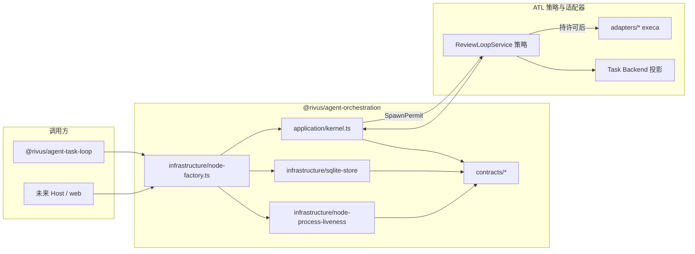
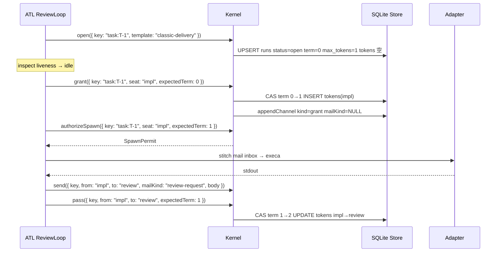
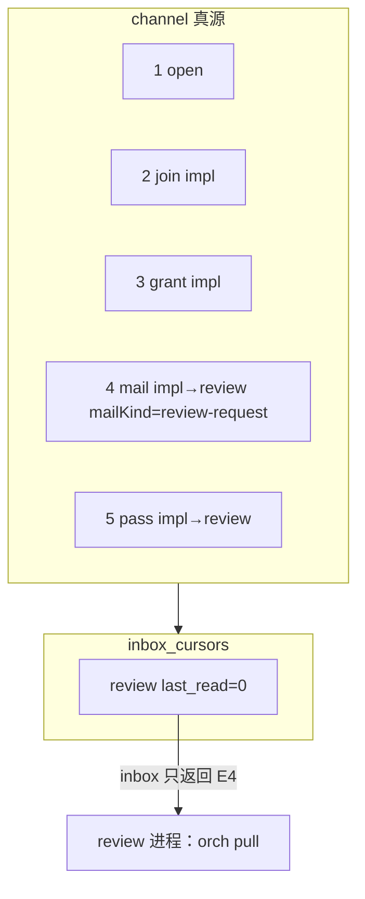
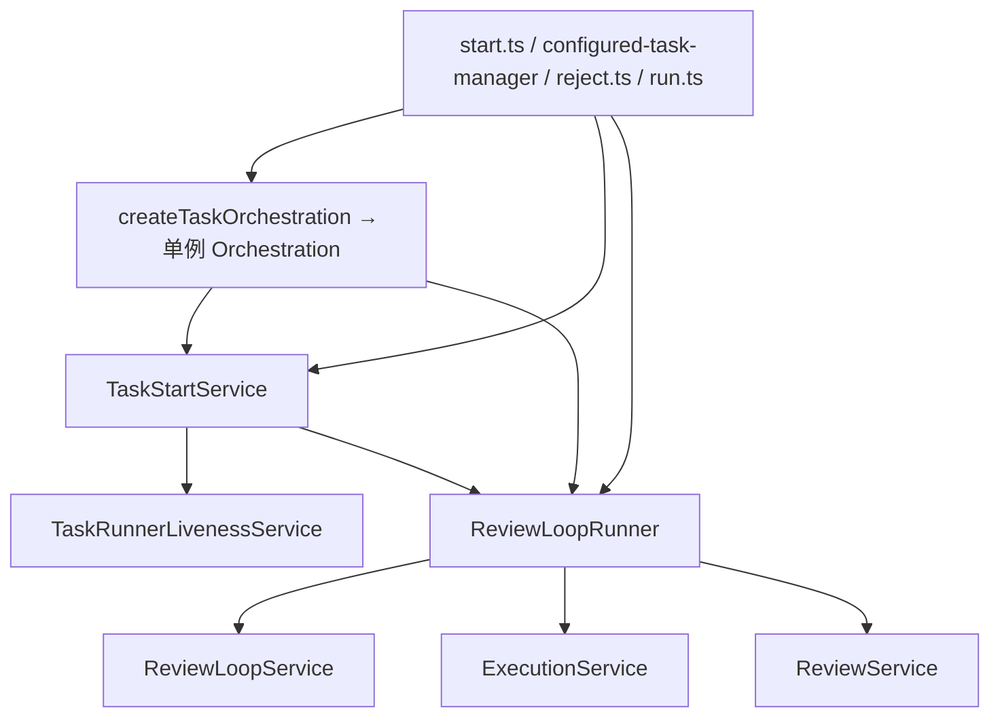
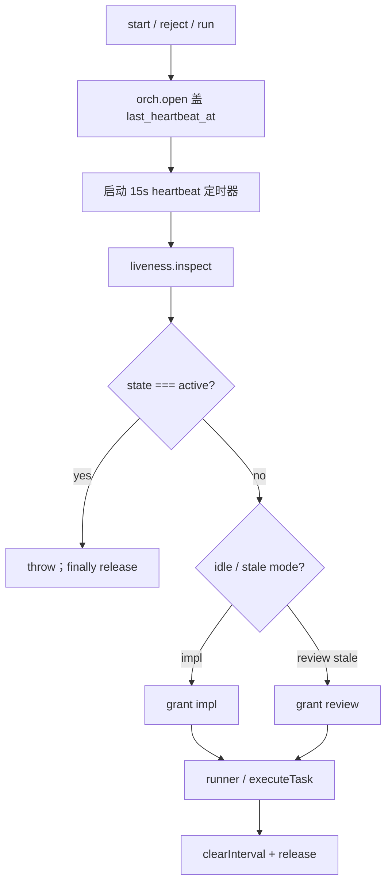

# `@rivus/agent-orchestration`：多 Agent 编码运行的元编排内核

| 字段 | 值 |
| --- | --- |
| Status | Draft（修订 4） |
| Author | agent-task-loop maintainers |
| Date | 2026-08-16 |
| Package | `@rivus/agent-orchestration`（`packages/agent-orchestration`） |
| Supersedes | 本文件即 `rfcs/0011-agent-orchestration.md`（替换 #95 occupy 草稿）。GitHub **#95 / #96 未合入 `main`**，不要先合再改 |
| Related | `CONTEXT.md`；`rfcs/0006-runtime-state-store.md`；`rfcs/0010-agentic-task-team-runtime.md`（在 `feat/grok-provider-reviewer-cas`，本分支缺文件，见下文对照表） |

---

## Overview

`@rivus/agent-orchestration` 是 monorepo 里的**元编排内核**：给一次多 seat 编码 run 提供上场权（最多 `maxTokens` 张 Token + 单调 `term`）、成员资格、以及一条全序、只追加的 **channel**。它不知道 Task、飞书、GitHub、ReviewLoop，也不住在 `@rivus/agent`（Host / Feishu / Session）里。`@rivus/agent-task-loop` 只是长在内核之上的第一个情景：把 `taskId` 映射为 run key `task:<id>`，注册模板 `classic-delivery`（seats `impl` / `review`），按策略 `grant` / `send`，并把 Task Backend 状态当成投影来写。

当前工作区是 **#96**（`feat/atl-orchestration-occupy`）叠在 **#95**（`feat/agent-orchestration`）上。二者对 `main` 都是 **OPEN**，`main` 上没有 `packages/agent-orchestration`。#95/#96 实现的是 `occupy.lock` 的 `wx` 文件锁 + 每 run 一份 `state.json` 袋子 + 内核里的 `execa`，ATL 只在 `TaskStartService.startTask` 外包一层 `open` / `finally release`。**不要把这两条 PR 合进 `main`。** 本设计替换它们：SQLite 上的 CAS 报数、channel 为真、消息永不授权工作、application 不碰 `node:fs` / `execa` / `process`。

全部 domain 命令使用**同一个**对象入参、**同步** API。依据是 Node 22.13+ `node:sqlite` 的 `DatabaseSync`（该类暴露的 API 全部同步执行；22.13 起不再需要 `--experimental-sqlite`）。非正式写法 `grant(key, seat)` 不是规格。

---

## Background & Motivation

### 当前工作区（#95+#96，未合入 main）实际是什么

`packages/agent-orchestration` 今天的形状：

| 文件 | 行为 |
| --- | --- |
| `src/store.ts` `FileOrchestrationStore` | `writeFileSync(..., { flag: 'wx' })` 建 `occupy.lock`；`state.json` 整包读写 |
| `src/orchestration.ts` `Orchestration` | `open` 占坑，`allow` 改 `snapshot.allowed`，`sendMail` / `appendFact` 推进 JSON 数组，`spawn` 校验 `allowed === seat` 后直接 `runner()` |
| `src/spawn.ts` | `execa` + `process.env` |
| `src/templates.ts` | 进程内 `Map`，不持久化 |
| `src/paths.ts` | 默认根 `~/.agent-orchestration/runs/<safeSegment>/` |

ATL 接入只有两处：

- `packages/agent-task-loop/src/orchestration/task-orchestration.ts`：构造时 `templates.register({ id: 'classic-delivery', seats: ['impl','review'], allow: { start: 'impl' } })`，key 为 `task:${taskId}`。
- `packages/agent-task-loop/src/task-manager/task-start-service.ts`：`open` 成功后跑既有 `ReviewLoopRunner`，`finally release`。失败时把 `OrchestrationConflictError` 翻成 “already has an active orchestration”。它**从不**调用 `heartbeat`。

`createConfiguredTaskManagerApplication`（`configured-task-manager.ts`）和 `commands/start.ts` 各自 `new ReviewLoopRunner({ config, taskService })`，**不注入** orchestration。`TaskStartService` 默认 `createTaskOrchestration()`，类型收成 `{ open, release }`。`commands/reject.ts` 同样 `new ReviewLoopRunner({ config, taskService })` 后 `RejectService.runLoop` → `runner.run`，**不经过** `TaskStartService`。`commands/run.ts` 直接 `new ExecutionService` → `executeTask`。`ReviewLoopService` / `ExecutionService` / `ReviewService` / `adapters/*` **完全不经过内核**。`ExecutionService.executeTask` 仍直接 `adapter.execute`（底层 `runAgentCommand` → `execa`），15s 心跳写的是 Task Backend / `TaskStateStore`，不是内核。

### 痛点

1. **占坑 ≠ 报数。** `wx` 锁回答“哪个 OS 进程占着这个 key”，不回答“哪个 seat 被授予工作权”。`allow` 是字段赋值，不是带 `term` 的 CAS。
2. **JSON 袋子把黑板当成调度器。** `facts[]` + `mail[]` + `allowed` 塞在同一份 `RunSnapshot` 里。
3. **没有全序 log。** 邮件是数组 append，无 `idx`、无 `term`。
4. **内核依赖 Node 副作用。** `writeFileSync`、`process.kill(pid, 0)`、`execa` 都在 domain 类里。
5. **模板是内存。** 第二个进程看不到第一个进程 `register` 的模板。
6. **CLI 被当成对等通信端。** `spawn` 把二进制当成员。
7. **ATL 只用了 occupy，且 120s 后锁自己过期。** `TaskStartService` 不打 kernel heartbeat，ReviewLoop 跑过 120s 后第二个 `start` 可以夺走 `occupy.lock`。
8. **注入图缺失。** ReviewLoop 看不见 kernel；两个 `createTaskOrchestration({ dbPath: ':memory:' })` 是两份库。

### 任务语言（不要污染内核）

`CONTEXT.md` 已锁定 ATL 词汇：**Task** / **Task Backend** / **Task Run** / **Task Manager** / **External Worker**。内核词汇是另一套：**run** / **seat** / **template** / **token** / **term** / **channel** / **inbox**。禁止把 `TaskRecord`、`待复核`、`ReviewLoop`、`currentOwner` 放进 `packages/agent-orchestration`。

### 与 RFC 0010 的关系（`feat/grok-provider-reviewer-cas`）

0010 是产品 RFC（Task Team / RoleId / CodingProvider），763 行，本分支没有文件。机制/策略切分与 0010 兼容，但本内核**覆盖** 0010 的两处通信/身份选择：

| RFC 0010 | 本内核 | 说明 |
| --- | --- | --- |
| RoleId `lead` / `implementer` / `reviewer` | seat 字符串。ATL `classic-delivery` 用 `impl` / `review` | 内核无 `Lead` 类型。0010 的 lead = ATL 进程里的 ReviewLoop（监督者），不是 kernel principal |
| `TeamMessage.log`，per-inbox FIFO，**无跨 inbox 全序** | 一条 run 内全序 `channel` + 每 seat cursor | **有意覆盖** 0010。web 要画一条 committed log（Raft-*like* 展示），全序是观察面的前提 |
| “Only lead assignment with a grant spawns a unit” | `grant` / `pass` + `authorizeSpawn` | 同意。`grant` 是监督者命令，内核不认证调用方（本机 DB = 信任边界） |
| Messages never trigger work | `send` 不改 `tokens` | 同意，本设计的负载不变量 |
| `claimTask` + `expectedStatus` CAS 作为 backstop | **保留为 ATL/Backend 投影级 backstop**（若 grok 分支那份工作合入） | **不是**报数。双 start 先被 kernel `open` 拒绝。`TaskStateConflictError` 防的是后端字段互踩，内核不实现它 |
| Classic Delivery 是发出消息的 *policy* | ATL 模板 `classic-delivery` + ReviewLoop | 同意：模板是数据，循环是策略 |

---

## Goals & Non-Goals

### Goals

- 上场权：每个 open run 同时最多 `maxTokens` 张 Token（模板字段，整数 ≥ 1，默认 1）；`runs.term` 单调递增；`grant` / `pass` 在 Store 事务里 CAS；**消息不授权工作**。满员再 `grant` 且未指定收回 → `orchestration-conflict`。
- 通信：每 seat 一个 inbox cursor；一条 append-only channel（`idx` + `term` + 邮件行上的 `mailKind`）是真相，也是未来 web 观察面。
- 存储：默认 SQLite WAL，路径 `~/.agent-orchestration/orchestration.db`。JSON 只允许出现在 channel `body TEXT`。测试用 `:memory:` 仅限**内核单测**（单连接）；跨进程 CAS 测必须打到同一文件。
- 分层：`application/` 与 `contracts/` 零 `node:*` / `execa` / `better-sqlite3`，且不得 import `../infrastructure/**`。`node:sqlite` 只活在 infrastructure。pid / 时钟 / DB 由 factory 注入。
- 模板即数据：无 `Team` / `Lead` 类型。seat 名是字符串。`classic-delivery` 由 ATL 注册。
- 观察 API 在 PR1 冻结：`channel({ key, fromIndex })`、`snapshot(key)`。
- ATL v1 **必须**走 `open` / `grant` / `send` / `channel` / `heartbeat` / `release`，不能只 occupy。`authorizeSpawn`：PR2b 在 ReviewLoop 调用点发出许可并记 channel；PR3 才在 `ExecutionService` / `ReviewService` **拒绝**无许可的 `adapter.execute`。v1 不把“无许可就 execa 不了”写成已交付。

### Non-Goals

- 实现 Raft 选举、日志复制、commit/apply 分家、多数派。
- 把内核搬进 `@rivus/agent`。
- 在内核里写 provider argv 方言。
- v1 实现 MCP `inbox.read` / `inbox.send`。
- 用工作区 `inbox.json` 当协议。
- 把 ReviewLoop、发布、验收、Feishu/GitHub claim 下沉到内核。
- 合并 RFC 0006 的 `TaskStateStore` 与本库。
- 跨机器复制 orchestration.db。
- 密码学 capability、多租户 ACL。
- 从 #95 的 `runs/*/state.json` 做数据迁移（那些文件不会上 `main`）。
- 把 `cmd` 暴露给 web `snapshot`。

---

## Key Decisions

Open Question 1 closed 2026-08-16: node:sqlite + engines >=22.13.

1. **上场权是唯一调度机制；channel 只记录。** 一场同时最多 `maxTokens` 张 Token。`grant` / `pass` 事务内 CAS `runs.term`。`send` 只 `INSERT channel`，永不增删 Token。
2. **`grant` 发一张或改派一张；`pass` 转让已有的一张。** `grant({ seat, partition?, expectedTerm, revokeSeat? })`：若已有该 seat 的牌则视为续发/改 partition（term+1）；若新发且张数已达 `maxTokens`，必须带 `revokeSeat`（收回那张再发），否则 `OrchestrationConflictError`。`maxTokens=1` 且已有持牌人、未传 `revokeSeat` 时，为兼容监督者改派：**默认收回仅有的那张**（yank）。`maxTokens>1` **必须**显式 `revokeSeat` 才能挤掉别人。`pass` 要求 `from` 持有一张牌。测试：`maxTokens=2` 连续 grant 两个不同 seat 成功；第三张无 revoke 失败；`maxTokens=1` 对另一 seat grant 成功（yank）。
3. **`authorizeSpawn` 发许可，adapter 才 `execa`。** 删除内核 `spawn.ts`。调用点在 PR2b；构造期强制（无 `SpawnPermit` 不许 `adapter.execute`）在 PR3。
4. **Coding Agent 默认用本机 `orch` CLI 读/写 Channel。** spawn 时注入 `ORCH_RUN` / `ORCH_SEAT`（以及 PATH 上的 `orch`）。`orch pull` / `orch send` 调同一套 domain API；身份只认环境，忽略进程自己改座位。没有 shell 的才 stitch 未读 mail。stdout `harvestMail` 仅作「没调 orch send、但吐了 JSON」的回收。禁止 workspace `inbox.json`。MCP / A2A / 往另一 TUI 打字都不是内核协议。`inbox.markRead` 默认 `false`（`orch pull` 成功后再标）。impl 返工仍用 `promptOverride`，不把 `review-verdict` 再缝一遍。
5. **默认驱动是 `node:sqlite` 的 `DatabaseSync`；`@rivus/agent-orchestration` 与第一个依赖它的 ATL 发布 engines 均为 `>=22.13`。** 不用 `better-sqlite3`，无 native addon。Node 22.13.0 起 `node:sqlite` 不再藏在 `--experimental-sqlite` 后；`DatabaseSync` 全部同步，因此冻结的 domain API **保持 sync**。`@rivus/rslib-config` 今天 `bundle: true`：PR1 把 `node:sqlite` 标为 rslib `externals`（内置模块，防止被 inline/polyfill），`package.json` **不**把它写成 npm dependency。pack 检查：无 `better-sqlite3`、无 `.node` addon；不假设要打一份 SQLite 二进制。已发布的 ATL `0.10.0` 可继续 `>=20`，直到那个依赖本包的版本一起升 engines。CI（`.github/workflows/ci.yml`）已是 Node 24，无需为驱动改 CI 镜像。
6. **ATL 发布策略（锁死，不是问题）。** 内核保持 `private` 直到**第一个依赖它的 ATL npm 版本**；那个版本必须把 `@rivus/agent-orchestration` **正式 publish**（建议 `0.1.0`），不能让已发布的 ATL `0.10.0+` 带着无法解析的 `workspace:*`。该 ATL 版本 `engines` 升到 `>=22.13`。在那之前：#95/#96 不要合 `main`，本设计的 PR 合 `main` 时与 ATL 接线同一列车，并带上 publish 决定（changeset + 取消 `private`）。
7. **`templates.register` 对相同 spec 幂等。** 相等定义：相同 `id` + 相同 `startSeat` + 相同 `maxTokens` + **排序后的 seats** + **排序后的 `(from, to, kind)` 三元组集合**。不同 spec → `OrchestrationTemplateError`。`maxTokens` 缺省为 1，必须 ≥ 1。
8. **`open` 不自动 grant。恢复路径的 award 在 `inspect` 之后，不是 `startSeat`。** idle / execute 恢复 → `grant({ seat: 'impl' })`；`resumeReview` → `grant({ seat: 'review' })`。`startSeat` 只是模板数据，给「全新 idle start」用。
9. **内核无 Team/Lead 类型。** 0010 的 lead = ATL 监督者进程（ReviewLoop），不是 kernel 类型。
10. **三套状态分离。** Task Backend ≠ ATL `TaskStateStore` ≠ orchestration SQLite。`claimTask` CAS（若合入）是投影 backstop，不是报数。
11. **不合并 #95/#96；无兼容层；无 `state.json` 迁移。** 删除 `allow` / `appendFact` / `sendMail` / `observe` / `spawn` / `FileOrchestrationStore`。今天测试/README 里的 `inspect` / `listRuns` / `bind` / `observe` 一并删除；本设计的 `inspect` 是 **v1 非导出 debug helper**（见下）。
12. **观察面 PR1 冻结。** `snapshot` / `channel` 是 web 合同。`snapshot` 无 cmd/env/pid。`inspect(key)`（不从 package 公共导出，测试与本机 CLI 可从 `/debug` 子路径或同包内部 import）返回 `supervisorPid` + `members.cmd`，因此 `members.cmd` **不是死数据**。
13. **Occupy 新鲜度 = kernel `heartbeat`，不是 Task Backend 心跳。** 默认 `staleAfterMs = 120_000`。每次成功的 `open`（首次 / stale 接管 / released 重开）**必须**写入 `last_heartbeat_at = clock.now()`，否则 `fresh` 谓词在 open 当下为假。ATL 在 `open` 成功后立刻启动 15s `heartbeat({ key })` 定时器（与 `release` 同 `try/finally`），覆盖 `ensureWorkspace` / 发布等无 adapter 的空隙。adapter `onHeartbeat` 可以顺带再 bump，**不得**当唯一来源。`heartbeat` **不做** term-CAS（见命令表）。缺这段定时器导致 takeover = 产品 bug。PR2a 验收。
14. **API 形状锁死：对象入参、同步、`expectedTerm` 必填。** 相对今天 `async open` 是 breaking。保持 sync 是因为 `DatabaseSync` 同步，不是因为曾经考虑过的 `better-sqlite3`。`send.body` 是调用方已 `JSON.stringify` 的 `string`。`HarvestedMail.body: unknown` → ATL `JSON.stringify` 后再 `send`。
15. **系统行 `kind` 与邮件路由 `mailKind` 分列。** `channel.kind` 是封闭的 `ChannelKind`（无 `heartbeat` 行）。邮件的路由名在 `mail_kind`。模板路由检查 `(from_seat, to_seat, mail_kind)`。内核解析 `body` 只为了长度，不解析 JSON 业务字段。

---

## Proposed Design

### 位置与依赖方向

```text
packages/agent-orchestration/     @rivus/agent-orchestration
packages/agent-task-loop/         调用方；内核不得反向 import
@rivus/agent                      不是家
```

目录名 `contracts/` / `application/` / `infrastructure/` 与 `packages/agent-finder/src` **只是同名分层**。finder 的 `application/discover.ts` **直接 import** `infrastructure/moonbit-api.js`，**不是**依赖倒置范本。本包禁止复制那种泄漏。



### 分层与强制规则

```text
packages/agent-orchestration/src/
  contracts/
    types.ts
    errors.ts
    store.ts          # OrchestrationStore + StoreTx + RunRow/RunPatch/...
    clock.ts          # Clock
    process-liveness.ts
  application/
    kernel.ts
    templates.ts
    inbox.ts
    validate.ts
  infrastructure/
    node-factory.ts   # createOrchestration：注入 store/clock/liveness/supervisorPid
    sqlite-store.ts   # node:sqlite DatabaseSync；:memory: 与文件路径
    schema.sql.ts     # 建表常量；不含 PRAGMA journal_mode
    node-clock.ts
    node-process-liveness.ts
    default-paths.ts
    cli-bridge.ts     # stitchInbox / harvestMail
    inspect.ts        # 非公共导出
  index.ts            # re-export contracts + application 类型 + createOrchestration
```

`tests/package-boundary.test.ts`：

- 继续禁 ATL 词（`TaskRecord` / `待处理` / `ReviewLoop` / `feishu` / `@rivus/agent-task-loop`）。
- `application/**` 与 `contracts/**` 禁止：
  - `from '../infrastructure/` / `from "../../infrastructure`
  - `from 'node:` / `from "node:`
  - `better-sqlite3` / `execa`
  - `process.kill` / `process.pid` / `writeFileSync`
- `createOrchestration` 只活在 `infrastructure/node-factory.ts`。`application/kernel.ts` 的 `supervisorPid` 来自构造注入（`number | null`），不读 `process.pid`。

### 默认工厂

```ts
export interface Clock {
  now(): number; // epoch ms
}

export interface ProcessLiveness {
  isAlive(pid: number): boolean;
}

export function createOrchestration(options?: {
  store?: OrchestrationStore;
  dbPath?: string;            // 默认 ~/.agent-orchestration/orchestration.db
  clock?: Clock;              // 默认 Date.now
  liveness?: ProcessLiveness; // 默认 process.kill(pid, 0) 包在 node-process-liveness
  supervisorPid?: number;     // 默认由 factory 读 process.pid 再注入；application 不碰 process
  staleAfterMs?: number;      // 默认 120_000
}): Orchestration
```

- 内核单测：`createOrchestration({ dbPath: ':memory:' })` —— **仅单连接**。
- CAS / 双进程测：两个 `createOrchestration({ dbPath: sharedFile })`。
- ATL 测试：注入**同一个** `Orchestration` 实例（或同一个 `dbPath` 文件）。禁止两个 factory 各开一份 `:memory:`。

`createTaskOrchestration`（ATL）必须把这份实例传给 `TaskStartService` **和** `ReviewLoopRunner`。

### 机制 vs 策略

| 机制（内核） | 策略（ATL / 未来 Host） |
| --- | --- |
| open / join / leave / release | 何时对哪个 `taskId` 开 run |
| grant / pass 的 term-CAS；heartbeat 只碰时间戳 | 下一个 token 给谁；恢复时给 impl 还是 review |
| send / inbox / channel | 邮件 body 的业务含义 |
| authorizeSpawn 发许可 | 是否真的拉起 CLI，argv 怎么拼 |
| 模板座位表与 mail 路由表 | `classic-delivery` 的字符串 |

### 上场权（最多 `maxTokens` 张 Token + term）

- `runs.term`：整数，从 0 起。成功的 `grant` / `pass`、以及 **released 后再 open** 时 +1。**stale-open 接管不 bump term。**
- `runs.max_tokens`：从模板拷贝，≥ 1。
- `tokens` 表：当前有效牌，一行一个 Seat（可选 `partition`，默认 `''`）。张数 ≤ `max_tokens`。
- 持牌 seat 才可以 `pass` 和 `authorizeSpawn`。
- 监督者可以 `grant` 发牌或改派（规则见 Key Decision 2）。
- `send` **不**读、不改 `tokens`。
- `partition` 非空时，同一 run 内不得两张牌抢同一 `partition`（避免两个人改同一目录）。空 partition 互不判重，只受 `maxTokens` 限制。



### Occupy：新鲜度、接管、重开

| 场景 | `term` | `tokens` | `supervisor_pid` | `last_heartbeat_at` | `last_index` / channel | members |
| --- | --- | --- | --- | --- | --- | --- |
| 首次 `open` | 0 | 空 | factory 注入的 pid | **`clock.now()`** | 从 0 append `open` + 每个模板 seat 一条 `join` | UPSERT `joined` |
| 新鲜 `open`（见下方 `fresh`） | 不变 | 不变 | 不变 | 不变 | 不变；抛 `OrchestrationConflictError` | 不变 |
| **stale-open 接管**（不 `fresh`） | **不变** | **清空** | 新进程 pid | **`clock.now()`** | **`last_index` 不变；不 append 任何 channel 行**（审计 = 下一条 `grant`；计数 `orch_stale_takeover_total`） | UPSERT 保持座位；`left` 保持 `left` |
| **released 后再 open** | `old.term + 1` | **空** | 新 pid | **`clock.now()`** | **续写**：append `kind=open` + 对每个**现在** `joined` 的 seat 一条 `join`。`last_index` += `1 + N_joined` | UPSERT 全部模板 seat → `joined` |

`supervisor_pid` **只**由 `open`（含接管/重开）写入。`heartbeat` **只**更新 `last_heartbeat_at` / `updated_at`，不 bump term、不写 channel、**不走 `casRun`**。`application` 不读 `process`。

stale 判定（`open` 内）：

```
fresh =
  status === 'open'
  && last_heartbeat_at 可解析
  && clock.now() - heartbeat <= staleAfterMs
  && supervisor_pid != null
  && liveness.isAlive(supervisor_pid)
```

因此：`open` 若不写 `last_heartbeat_at`，成功当下 `fresh` 就是假，第二个 `start` 可以零等待接管。这是实现禁区。

pid 死 **或** 心跳过期 ⇒ **内核**认为可接管。ATL 是否真的开第二 worker 还要看下一节的 `inspect.state === 'active'` 守卫——kernel stale **不能**单独授权双 `execa`。

### Channel 与 inbox

Channel 是 run 内全序 log。`idx` 从 1 连续递增，等于 `runs.last_index`。v1 单写者 SQLite，写出即 committed。

**只有 `appendChannel` 可以增加 `last_index`。** 它在同一事务里：读 `last_index`，`idx = last_index + 1`，INSERT，再写回 `last_index`。调用方**不能**传入 `idx`。

Inbox 是投影：`kind = 'mail' AND (to_seat = $seat OR to_seat IS NULL) AND idx > cursor`。

- **`inbox.markRead` 默认 `false`。** `orch pull` 成功打印之后才 `markRead: true`。stitch 回退路径：仅在子进程已经 `onSpawn` 成功之后才标记。pull/stitch 后、干活前崩溃 ⇒ 仍未读，可重试。
- **`orch pull` 与 stitch 都只返回 `kind === 'mail'`。** `grant` / `pass` / `spawn-authorized` 仍在 `channel()` / `orch log` 里，**不**当作未读留言。
- `to_seat IS NULL` 的 mail 是广播，进入每个 seat 的 mail inbox。



### Client：`orch` CLI（默认）+ stitch 回退

Coding Agent 默认在自己的 shell 里读/写 Channel，不往另一个 TUI 打字（那是 Herdr）。

spawn 许可发出后，调用方必须带上：

```text
ORCH_RUN=<key>
ORCH_SEAT=<seat>
PATH 含 orchestration 的 bin（命令名 `orch`）
```

`orch` **忽略** 进程传入的 `--seat` / `--run`（若提供则必须与环境一致，否则退出码非 0）。防止冒充。

```text
orch pull                      # inbox；成功后可 markRead
orch send <seat> <text>        # send；mailKind 默认 note；--kind review-request
orch log [--from idx]          # channel，与 snapshot/web 同一份
```

`orch send` 不改 Token。无 Token 也能 send（留言）；`authorizeSpawn` 仍要持牌。

没有 shell / 不调 `orch` 的进程：调用方 stitch 未读 mail 进 prompt。stdout 里若出现 `{ mail: [...] }`，`harvestMail` 回收进 `send`（没调 CLI 时的退路）。**有 shell 的路径以 `orch send` 为准**，不要对同一轮再 harvest 一遍（双写）。

本分支**没有** `grok.ts`。`TARGET_AGENTS` = `claude | codex | coco | glm`。

`infrastructure/cli-bridge.ts` + `bin/orch` 在 **PR1** 落地：

```ts
export interface HarvestedMail {
  to: string;
  mailKind: string;
  body: unknown;
}

export interface OutboundEnvelope {
  mail: HarvestedMail[];
}

export function stitchInbox(basePrompt: string, entries: ChannelEntry[]): string
export function harvestMail(text: string): HarvestedMail[]
```

`harvestMail` 策略与 `tryParseReviewPayload` 相同：整段 JSON → 倒着逐行 → 识别 `{ mail: [...] }`。失败返回 `[]`。

**ATL 包装策略（锁死，避免双写/双注入）：**

| 方向 | 做法 | 不做 |
| --- | --- | --- |
| impl → review | 默认 impl 自己 `orch send review …`。若整轮没有 orch send，才 `harvestMail` 回收 | 有 orch send 就不要再 harvest 同一轮；不要把整份 transcript 当 body |
| review → impl | ReviewService 仍解析 `{"verdict","findings"}`。ATL **wrap 一次** `send({ mailKind: 'review-verdict' })`。审查进程也可用 `orch send`；若已 orch send 了同语义，不再 wrap | **禁止**对同一段 review stdout 再 `harvestMail` |
| impl 下一轮返工 | 继续 `buildReworkPrompt` → `promptOverride`。impl 上场后自己 `orch pull` 看审查留言 | **禁止**再把 `review-verdict` stitch 进 impl prompt |
| 无 shell | `inboxSuffix` / `stitchInbox` 仅此回退 | 不要让 ReviewService import orchestration |
| grok（他分支） | 有 shell 则 `orch`；harvest 视为空 mail，除非接 json-schema | 不要假装 grok 已吐 `OutboundEnvelope` |

stitch 围栏（只含 mail 行）：

```text
## orchestration-inbox
You are seat "review" on run "task:T-1". Messages do not authorize work.

### idx=12 term=2 from=impl to=review mailKind=review-request
{"summary":"..."}
## end-orchestration-inbox
```

进程内角色直接调 `kernel.send` / `kernel.inbox` / `kernel.grant`。

### 模板是数据

```ts
export interface TemplateMailRoute {
  from: string;
  to: string;
  kind: string; // 写入 template_mail.kind，对应 send.mailKind
}

export interface TemplateSpec {
  id: string;
  seats: string[];
  startSeat?: string;
  /** Simultaneous Tokens allowed on one Run. Default 1. */
  maxTokens?: number;
  mail?: TemplateMailRoute[]; // 空 = 任意 joined 对可 send 任意 mailKind
}
```

ATL：

```ts
export const CLASSIC_DELIVERY_TEMPLATE: TemplateSpec = {
  id: 'classic-delivery',
  seats: ['impl', 'review'],
  startSeat: 'impl',
  maxTokens: 1,
  mail: [
    { from: 'impl', to: 'review', kind: 'review-request' },
    { from: 'review', to: 'impl', kind: 'review-verdict' },
    { from: 'impl', to: 'review', kind: 'note' },
    { from: 'review', to: 'impl', kind: 'note' },
  ],
};
```

`mail` 非空时，`send` 必须命中一条 `(from, to, mailKind)`。

### ATL 对象图与恢复



生产入口必须共用**同一套** occupy 包装（建议抽 `runWithOccupancy`，避免三份拷贝）：

| 生产构造点 | 今天 | PR2a 之后 |
| --- | --- | --- |
| `commands/start.ts` | `TaskStartService` + `ReviewLoopRunner`，无注入 | 共享 `orch`；`open → 定时器 → inspect → award → run → finally 停表+release` |
| `configured-task-manager.ts` | 同上 | 同上 |
| `commands/reject.ts` | `new ReviewLoopRunner({ config, taskService })` → `RejectService.runLoop` → `runner.run`。**无** Start、**无** open | `ReviewLoopRunner` **必填** `Orchestration`（禁止 optional）。走同一包装；验收打回是 **impl 返工**，`grant({ seat: 'impl' })`，不是 `resumeReview` |
| `commands/run.ts` | 直接 `new ExecutionService` → `executeTask`（one-shot impl，同一 `task:` key） | **必须** `open`。同一包装，`grant({ seat: 'impl' })`。已有新鲜 occupy ⇒ `OrchestrationConflictError`。禁止「legacy、可不 occupy」——那会和 `start` 双 `execa` |

`ReviewLoopRunner` 构造函数 **require** `orchestration: Orchestration`。缺省 `createTaskOrchestration()` 删除。PR2a 必须有编译/测试证明 `reject.ts` 传入同一实例。

`TaskStartService.startTask`（`reject` / `run` 同骨架）顺序：

1. 读 Task；算 `key = task:${id}`。
2. `orch.open({ key, template: 'classic-delivery', bind, goal, ref })` —— 成功路径写入 `last_heartbeat_at`。
3. **立刻**在同一 `try` 里启动 15s `setInterval(() => orch.heartbeat({ key }))`（`unref`）。`finally` 里 `clearInterval` 再 `release`。adapter `onHeartbeat` 可再 bump，不是唯一来源。
4. `livenessService.inspect(task)`。
5. **`inspection.state === 'active'` → throw 现有文案**（`already has an active ${mode} runner`），**不** `grant`、**不** `runner.run`。`finally` 仍 release。这是今天 `task-start-service.ts` 83–85 行的守卫，规格保留。
6. 仅 `idle` / `stale` 才 award（不是无条件 `grant(startSeat)`）：
   - `idle` 或 stale execute → `grant({ key, seat: 'impl', expectedTerm })`（`reject` / `run` 也走 impl）
   - `inspection.mode === 'review'` 且 `stale` → `grant({ key, seat: 'review', expectedTerm })` 再 `resumeReview`
7. 跑 runner / `executeTask`。
8. `finally`：停定时器 + `orch.release({ key })`。

**双 liveness：`active` 永远不接管 worker。**

| kernel `open` 结果 | ATL `inspect` | 行为 |
| --- | --- | --- |
| 冲突（已有 **fresh** occupy） | 任意 | 抛 `OrchestrationConflictError`。不到 inspect |
| 成功（新开 / stale 接管 / released 重开） | **`active`** | **throw**，不 award。含义：第一个 ReviewLoop 仍在跑，只是漏了 kernel 心跳或我们刚接管了行。修心跳，不要第二份 `execa` |
| 成功 | `stale` review | `grant(review)` → `resumeReview` |
| 成功 | `stale` execute / `idle` | `grant(impl)` → `run` |

kernel stale + ATL `active` **不是** takeover 开第二 worker 的许可证。

PR2a 测试：

- 无 adapter spawn、clock +1s、两次 `open` → 第二次 conflict（`open` 已盖心跳）。
- 有 15s 定时器、clock +120s → 第二次 `open` 仍 conflict。
- 故意不启定时器、clock +120s → stale takeover。
- stale-open 之后 mock ATL `active` → **无** `grant`、**无** `runner.run`。
- stale review + ATL `stale` → `grant(review)` 后该 seat 可 `authorizeSpawn`。



v1 约束：

- ReviewLoop 仍决定轮次、发布、失败。这是策略。
- PR2b：每轮 worker **调用** `authorizeSpawn` 并记 channel。忘掉调用仍可能 `execa` —— 这是已接受的风险，PR3 收口。
- 每轮 impl 结束：`harvestMail` → 可能的 `send`。review 结束：wrap verdict → **一次** `send`。
- 然后 `pass` 或 `grant({ seat: 'review' })`（监督者改派，合法 yank）。
- `claimTask` / 任务状态继续写后端，但是投影。
- **15s kernel heartbeat 定时器是 PR2a 验收项**，从 `open` 起到 `release`，不是「等第一轮 execa」。

---

## API / Interface Changes

### 作废（#95/#96 工作区 API，不要合 main）

```ts
orch.allow(key, seat)
orch.appendFact(key, seat, text)
orch.sendMail(key, { from, to, body })
orch.observe(key, seat)
orch.spawn(key, seat, { cwd })
orch.listRuns()
orch.bind(key, seat, bind)
orch.inspect(key)            // 旧的返回整包 RunSnapshot（含 cmd）——公共导出删除
new Orchestration({ runner, baseDir })
orch.templates               // 进程内 Map
```

相对今天：`open` 从 `async` 变为 **sync**。调用方去掉 `await`。

### 冻结的 domain API（全部对象入参、全部 sync）

```ts
export interface Orchestration {
  open(input: {
    key: string;
    template: string;
    bind?: Record<string, SeatBind>;
    ref?: Record<string, string>;
    goal?: string;
  }): RunSnapshot;

  join(input: { key: string; seat: string; bind?: SeatBind }): RunSnapshot;
  leave(input: { key: string; seat: string }): RunSnapshot;

  grant(input: {
    key: string;
    seat: string;
    expectedTerm: number;
    partition?: string;
    revokeSeat?: string;
  }): RunSnapshot;
  pass(input: {
    key: string;
    from: string;
    to: string;
    expectedTerm: number;
    partition?: string;
  }): RunSnapshot;
  heartbeat(input: { key: string }): void;

  send(input: {
    key: string;
    from: string;
    to: string | null;
    mailKind: string;
    body: string;          // 调用方 JSON.stringify；内核当 TEXT
  }): ChannelEntry;

  inbox(input: {
    key: string;
    seat: string;
    markRead?: boolean;    // 默认 false
    limit?: number;        // 默认 200
  }): ChannelEntry[];      // 仅 kind==='mail'

  channel(input: { key: string; fromIndex: number; limit?: number }): ChannelPage;
  snapshot(input: { key: string }): RunSnapshot;

  authorizeSpawn(input: {
    key: string;
    seat: string;
    expectedTerm: number;
  }): SpawnPermit;

  release(input: { key: string }): void;

  templates: {
    register(spec: TemplateSpec): TemplateSpec;
    get(input: { id: string }): TemplateSpec;
    list(): TemplateSpec[];
  };
}

export interface ChannelEntry {
  key: string;
  idx: number;
  term: number;
  kind: ChannelKind;
  mailKind: string | null;   // 非 null iff kind === 'mail'
  fromSeat: string | null;
  toSeat: string | null;
  body: string;
  createdAt: string;
}

export type ChannelKind =
  | 'open'
  | 'join'
  | 'leave'
  | 'grant'
  | 'pass'
  | 'mail'
  | 'spawn-authorized'
  | 'release';
// 注意：v1 不写 heartbeat 行，故不在联合里。

export interface ChannelPage {
  key: string;
  fromIndex: number;
  lastIndex: number;
  term: number;
  maxTokens: number;
  tokens: Array<{ seat: string; partition: string }>;
  entries: ChannelEntry[];
}

export interface RunSnapshot {
  key: string;
  template: string;
  status: 'open' | 'released';
  members: Array<{ seat: string; status: 'joined' | 'left' }>;
  term: number;
  maxTokens: number;
  tokens: Array<{ seat: string; partition: string }>;
  lastIndex: number;
  lastHeartbeatAt: string | null;
}

export interface SpawnPermit {
  key: string;
  seat: string;
  term: number;
  idx: number;
  issuedAt: string;
}

export interface SeatBind {
  cmd: string;
  args?: string[];
  // env 禁止入库
}
```

内部 debug（`infrastructure/inspect.ts`，**不**从 `index.ts` 导出）：

```ts
export function inspect(orch: Orchestration, key: string): {
  snapshot: RunSnapshot;
  supervisorPid: number | null;
  members: Array<{ seat: string; status: 'joined' | 'left'; cmd?: string; args?: string[] }>;
}
```

ATL 把 harvest 映射到 send 的唯一写法：

```ts
for (const mail of harvestMail(stdout)) {
  orch.send({
    key,
    from: seat,
    to: mail.to,
    mailKind: mail.mailKind,
    body: JSON.stringify(mail.body),
  });
}
```

### 命令表

| 命令 | 前置 | 事务内效果 |
| --- | --- | --- |
| `open` | 模板存在 | 见 Occupy 表。写 `supervisor_pid` **和** `last_heartbeat_at`。复制 `max_tokens`。成功路径上 **tokens 表为空**。channel：**首次** `open`+每 seat `join`；**stale 接管 0 行**；**released 重开** `open`+每个现 `joined` 的 `join` |
| `join` | run open；seat ∈ 模板 | UPSERT member → `joined`；`appendChannel kind=join` |
| `leave` | run open；seat joined | member → `left`；删该 seat 的 token 行（若有），**term 不变**；`appendChannel kind=leave`。PR1 测此项 |
| `grant` | run open；seat joined；`term === expectedTerm` | `casRun` term+1。新发：`INSERT tokens`；已满且 `maxTokens=1` 未传 `revokeSeat` → 删仅有的那张再插入（yank）；已满且 `maxTokens>1` 无 `revokeSeat` → `OrchestrationConflictError`；有 `revokeSeat` → 删那张再插入。`appendChannel kind=grant` |
| `pass` | `from` 在 tokens 中；`to` joined；term 匹配 | 把该行的 `seat` 改成 `to`（可改 partition）；term+1。非持牌 → `OrchestrationSeatError` |
| `heartbeat` | 无 term 入参 | `UPDATE runs SET last_heartbeat_at=?, updated_at=? WHERE key=? AND status='open'`。**不是** `casRun`，不读、不比 `term`，不改 `tokens`。`changes()==0`（已 `release` 或未知 key）→ **no-op**（`finally release` 与最后一拍竞态保持安静），不抛 |
| `send` | from joined；to 为 null 或 joined；过 mail 路由（若有） | `appendChannel kind=mail mail_kind=mailKind`。不碰 token。`body.length > 65536` → `OrchestrationValidationError` |
| `inbox` | seat 曾是成员 | `SELECT` 仅 `kind='mail'`；默认不改 cursor |
| `channel` | run 存在（含 released） | `idx >= fromIndex` |
| `snapshot` | 同上 | 无 cmd/env/pid |
| `authorizeSpawn` | `tokens` 含该 seat 且 term 匹配且 joined | `appendChannel kind=spawn-authorized`；返回 permit。不启动进程。未持牌 → `OrchestrationUnauthorizedError` |
| `release` | 幂等 | `status=released`，`DELETE FROM tokens`，清 `supervisor_pid`；`appendChannel kind=release`。保留 channel |
| `templates.register` | 合法 spec | 相同 spec no-op；不同 spec 抛错 |

`expectedTerm` 在 `grant` / `pass` / `authorizeSpawn` 上必填。调用方先 `snapshot({ key }).term`。`heartbeat` **没有** `expectedTerm`。

### 错误

| class | code | 何时 |
| --- | --- | --- |
| `OrchestrationConflictError` | `orchestration-conflict` | 新鲜 `open`；`grant`/`pass` term CAS 失败。字段 `key`、`supervisorPid?: number` |
| `OrchestrationNotFoundError` | `orchestration-not-found` | 未知 key / 已 released 上的变异命令（`channel`/`snapshot`/`inspect` 除外） |
| `OrchestrationSeatError` | `orchestration-seat` | 未知 seat、未 joined、`pass.from` 不是 holder |
| `OrchestrationTemplateError` | `orchestration-template` | 未知模板、非法 spec、register 冲突 |
| `OrchestrationUnauthorizedError` | `orchestration-unauthorized` | `authorizeSpawn` 未持牌 |
| `OrchestrationValidationError` | `orchestration-validation` | body > 64 KiB、缺字段、`mailKind` 在非 mail 行上出现 |

### Store port 与行类型

```ts
export interface Clock {
  now(): number;
}

export interface ProcessLiveness {
  isAlive(pid: number): boolean;
}

export interface RunRow {
  key: string;
  templateId: string;
  term: number;
  maxTokens: number;
  status: 'open' | 'released';
  supervisorPid: number | null;
  lastHeartbeatAt: string | null;
  lastIndex: number;
  goal: string | null;
  refJson: string | null;
  createdAt: string;
  updatedAt: string;
}

/** casRun 允许的补丁。禁止含 lastIndex。 */
export interface RunPatch {
  term?: number;
  status?: 'open' | 'released';
  supervisorPid?: number | null;
  lastHeartbeatAt?: string | null;
  goal?: string | null;
  refJson?: string | null;
  updatedAt: string;
}

export interface MemberRow {
  runKey: string;
  seat: string;
  status: 'joined' | 'left';
  cmd: string | null;
  argsJson: string | null;
  joinedAt: string;
  leftAt: string | null;
}

export interface ChannelRow {
  runKey: string;
  idx: number;
  term: number;
  kind: ChannelKind;
  mailKind: string | null;
  fromSeat: string | null;
  toSeat: string | null;
  body: string;
  createdAt: string;
}

export interface OrchestrationStore {
  migrate(): void;
  withTransaction<T>(fn: (tx: StoreTx) => T): T;
}

export interface StoreTx {
  getTemplate(id: string): TemplateSpec | undefined;
  putTemplate(spec: TemplateSpec): void;
  listTemplates(): TemplateSpec[];

  getRun(key: string): RunRow | undefined;
  upsertRun(row: RunRow): void;
  /** WHERE key=? AND term=expectedTerm。禁止在此改 lastIndex。 */
  casRun(key: string, expectedTerm: number, patch: RunPatch): boolean;
  /**
   * 非 CAS。`UPDATE runs SET last_heartbeat_at=?, updated_at=? WHERE key=? AND status='open'`。
   * 返回是否更新到一行。heartbeat() 对 false 做 no-op。
   */
  touchHeartbeat(key: string, at: string): boolean;

  listMembers(key: string): MemberRow[];
  upsertMember(row: MemberRow): void;

  /** 唯一的 last_index 变更点。调用方不传 idx。 */
  appendChannel(row: Omit<ChannelRow, 'idx'>): ChannelRow;
  listChannel(key: string, fromIndex: number, limit: number): ChannelRow[];

  getCursor(key: string, seat: string): number;
  setCursor(key: string, seat: string, idx: number): void;
}
```

`withTransaction` → `BEGIN IMMEDIATE`。

grant 伪代码（注意 **没有** 第二次 `UPDATE last_index`）：

```
tx = BEGIN IMMEDIATE
run = tx.getRun(key)
assert run.status=='open' && run.term==expectedTerm && seat joined
ok = tx.casRun(key, expectedTerm, {
  term: expectedTerm + 1,
  updatedAt: iso,
})
if (!ok) throw Conflict
// insert/replace row in tokens per Key Decision 2
tx.appendChannel({
  runKey: key, term: expectedTerm + 1, kind: 'grant',
  mailKind: null, fromSeat: null, toSeat: seat, body: '{}', createdAt: iso,
})
COMMIT
```

---

## Data Model Changes

### Schema（`schema.sql.ts`：只含表。WAL 是连接 pragma）

打开连接后、migrate 前，**每个连接**执行：

```sql
PRAGMA journal_mode = WAL;   -- 连接级，不要放进 migrate 事务
PRAGMA foreign_keys = ON;
PRAGMA busy_timeout = 5000;
PRAGMA synchronous = NORMAL;
```

NFS / 网络 home：WAL 在部分网络盘上不可靠。v1 文档写明「DB 必须在本地磁盘」；不探测 NFS，失败即报 SQLite 错。

```sql
CREATE TABLE schema_meta (
  id INTEGER PRIMARY KEY CHECK (id = 1),
  version INTEGER NOT NULL
);
INSERT INTO schema_meta (id, version) VALUES (1, 1);

CREATE TABLE templates (
  id TEXT PRIMARY KEY,
  start_seat TEXT,
  max_tokens INTEGER NOT NULL DEFAULT 1 CHECK (max_tokens >= 1),
  created_at TEXT NOT NULL,
  updated_at TEXT NOT NULL
);

CREATE TABLE template_seats (
  template_id TEXT NOT NULL REFERENCES templates(id) ON DELETE CASCADE,
  seat TEXT NOT NULL,
  ordinal INTEGER NOT NULL,
  PRIMARY KEY (template_id, seat)
);

CREATE TABLE template_mail (
  template_id TEXT NOT NULL REFERENCES templates(id) ON DELETE CASCADE,
  kind TEXT NOT NULL,
  from_seat TEXT NOT NULL,
  to_seat TEXT NOT NULL,
  PRIMARY KEY (template_id, kind, from_seat, to_seat)
);

CREATE TABLE runs (
  key TEXT PRIMARY KEY,
  template_id TEXT NOT NULL REFERENCES templates(id),
  term INTEGER NOT NULL DEFAULT 0,
  max_tokens INTEGER NOT NULL DEFAULT 1 CHECK (max_tokens >= 1),
  status TEXT NOT NULL CHECK (status IN ('open', 'released')),
  supervisor_pid INTEGER,
  last_heartbeat_at TEXT,
  last_index INTEGER NOT NULL DEFAULT 0,
  goal TEXT,
  ref_json TEXT,
  created_at TEXT NOT NULL,
  updated_at TEXT NOT NULL
);

CREATE TABLE tokens (
  run_key TEXT NOT NULL REFERENCES runs(key) ON DELETE CASCADE,
  seat TEXT NOT NULL,
  partition TEXT NOT NULL DEFAULT '',
  PRIMARY KEY (run_key, seat)
);

CREATE TABLE members (
  run_key TEXT NOT NULL REFERENCES runs(key) ON DELETE CASCADE,
  seat TEXT NOT NULL,
  status TEXT NOT NULL CHECK (status IN ('joined', 'left')),
  cmd TEXT,
  args_json TEXT,
  joined_at TEXT NOT NULL,
  left_at TEXT,
  PRIMARY KEY (run_key, seat)
);

CREATE TABLE channel (
  run_key TEXT NOT NULL REFERENCES runs(key) ON DELETE CASCADE,
  idx INTEGER NOT NULL,
  term INTEGER NOT NULL,
  kind TEXT NOT NULL,
  mail_kind TEXT,
  from_seat TEXT,
  to_seat TEXT,
  body TEXT,
  created_at TEXT NOT NULL,
  PRIMARY KEY (run_key, idx),
  CHECK (
    (kind = 'mail' AND mail_kind IS NOT NULL)
    OR (kind <> 'mail' AND mail_kind IS NULL)
  )
);

CREATE TABLE inbox_cursors (
  run_key TEXT NOT NULL REFERENCES runs(key) ON DELETE CASCADE,
  seat TEXT NOT NULL,
  last_read_idx INTEGER NOT NULL DEFAULT 0,
  PRIMARY KEY (run_key, seat)
);

CREATE INDEX channel_mail_to_idx ON channel (run_key, kind, to_seat, idx);
CREATE INDEX runs_status ON runs (status);
```

`migrate()` 读 `schema_meta.version`。v1 只建这些表。更高版本用递增整数；本设计不预写 v2。

### 默认文件

| 路径 | 命运 |
| --- | --- |
| `~/.agent-orchestration/orchestration.db`（+ `-wal` / `-shm`） | 新默认 |
| `~/.agent-orchestration/runs/*/occupy.lock` | **仅当 #95 曾在某台机器 checkout 过**才可能存在。内核忽略。changelog 只在 #95 真的合过才提 |

### 容量

本机 1–10 run，每 run 2–4 seat。`send.body` 硬顶 64 KiB → `OrchestrationValidationError`。`channel`/`inbox` 默认 `limit=200`。本机 SSD p99：`grant`/`send`/`authorizeSpawn` < 10 ms。

### 与 ATL `TaskStateStore` 的边界

RFC 0006 继续管 session/pid/workspace。TUI / 未来 web 读 `snapshot` / `channel`，不要把 `tokens` 镜像进 Feishu。

---

## 未来 Web 观察面

```ts
kernel.snapshot({ key })
kernel.channel({ key, fromIndex })
```

```text
run  task:T-1    template classic-delivery    status open
term 4           token review                 lastIndex 8

members
  impl    joined
  review  joined   ← token

log
  1  t=0  open
  2  t=0  join     impl
  3  t=0  join     review
  4  t=1  grant            → impl
  5  t=1  spawn-authorized impl
  6  t=1  mail     impl → review   mailKind=review-request
  7  t=2  pass     impl → review
  8  t=2  spawn-authorized review
```

单框“leader”= 这台机器的 SQLite 写者。无 votedFor / nextIndex。轮询 1s。`snapshot` 无 cmd/env/`supervisor_pid`。

---

## Alternatives Considered

### A. 在 #95 文件锁上继续长

否决。无 term CAS，domain 绑死 `wx`/`execa`。

### B. 共享 Task 状态自调度

否决。Contract Net 反模式。Anthropic 2026-08：对等无层级会跌跤；CEO **prompt** ≠ occupancy。

### C. 内核实现 Raft

否决（v1）。单机编码 run 不需要选举/复制。

### D. engines 升 22.13+，用 `node:sqlite` `DatabaseSync`

**采纳（2026-08-16）。** 这是默认驱动。代价是 `@rivus/agent-orchestration` 与第一个依赖它的 ATL 发布把 `engines` 提到 `>=22.13`；已发布的 ATL `0.10.0` 不受影响，直到那次接线发布。换来的是零 native addon、与 CI Node 24 对齐。`node:sqlite` 在 22.13 仍标 experimental，但不再需要 flag；Store port 留下日后换实现的缝，不挡 v1。

### E. MCP inbox 作为 v1 内核协议

否决为协议。Claude 可选 adapter（PR6）。

### F. 不合并 #95/#96，本设计作为内核的第一份公开形状

**采纳。** 这是最便宜的 rollout：关闭或改指向这两条 PR，`main` 从不出现 `occupy.lock` API。无兼容、无迁移、无“从 main revert 文件锁”。

### G. wasm `sql.js` / libsql / `better-sqlite3`

不选为 v1 默认。`sql.js` 无可靠多进程 `BEGIN IMMEDIATE`；libsql 多一个运行时；`better-sqlite3` 要 native 编译，已被 OQ1 否决。`node:sqlite` 是内置 `DatabaseSync`。

### H. 0010 的 per-inbox 队列、无跨 inbox 全序

否决。web 要一条 committed log；cursor 投影已经给出 per-seat FIFO。全序是刻意覆盖 0010「no cross-inbox total order」。

---

## Security & Privacy Considerations

信任边界是本机文件系统。能打开 `orchestration.db` 就能 `grant` 给自己。这是机制，不是漏洞。

| 威胁 | 严重度 | 缓解 |
| --- | --- | --- |
| channel body 写入 API key | 高 | `SeatBind.env` 禁止入库；`snapshot`/`channel` 无 env |
| web 泄漏 cmd | 中 | `snapshot` 无 cmd；cmd 仅 `inspect` |
| mail 里写“你被授权开工” | 低（相对报数） | `send` 不改 token；stitch 只含 mail 且声明不授权 |
| stitch 后、execa 前崩溃丢信 | 中 | `markRead` 默认 false；spawn 成功后再标已读 |
| 旧 occupy.lock 造成安全感错觉 | 中 | 那些文件不应上 main；忽略 |
| `runAgentCommand` 拷贝 `process.env` | 已知 | **留在 ATL**（`adapters/base.ts`）。`cli-bridge` 只拼字符串，本来就不碰 env。不要把“不拷贝 env”写成 stitch 的责任 |

---

## Observability

channel 就是审计日志。

每条命令一行：`key, cmd, seat, term, idx, ok, code`。

| 名字 | 含义 | 告警草稿 |
| --- | --- | --- |
| `orch_open_conflict_total` | 新鲜 open 冲突 | 同 task 双 start |
| `orch_cas_fail_total` | grant/pass term 不匹配 | 策略丢了 snapshot.term |
| `orch_spawn_unauthorized_total` | 无牌 spawn | 接线错误 |
| `orch_harvest_empty_total` | 编码轮无 mail | 正常 |
| `orch_harvest_fail_total` | envelope 解析失败 | 与 review wrap 失败对齐 |
| `orch_db_busy_total` | SQLITE_BUSY | 查长事务 |
| `orch_stale_takeover_total` | stale-open 接管 | 心跳漏打 |

本机 debug：内部 `inspect(key)` 看 `supervisorPid` + `members.cmd`。不要为此放宽 `snapshot`。

---

## Rollout Plan

`#95` OPEN → `main`（`feat/agent-orchestration`）。`#96` OPEN → `#95`（`feat/atl-orchestration-occupy`，即本工作区）。`main` 无此包。

1. **不要合并 #95/#96。** 关闭或 retarget 到本设计的分支。changelog **不必**提 `occupy.lock`，除非有人已经把 #95 合进了某条会进 `main` 的线。
2. 新 PR 列车：PR1（内核）与 PR2a/PR2b（ATL）同一开发分支；`pnpm -r test` / `typecheck` 不允许“只合内核”。
3. 无 feature flag 双实现。无 JSON → SQLite 迁移。
4. 进行中的 ReviewLoop：因为 #95 未上 main，升级对现网 **无 in-flight occupy 状态**。操作 = 和平常一样跑 `start`。
5. 第一个把 ATL 依赖指向本包的发布：publish `@rivus/agent-orchestration@0.1.0`，去掉 `private`，ATL 依赖改为 semver（见 Key Decision 6）。
6. 验证：`pnpm test`、`pnpm build`；orchestration 目录 `npm pack --dry-run --registry=https://registry.npmjs.org`：`package.json` `engines` 为 `>=22.13`；无 `better-sqlite3` 依赖；`dist/index.js` 不 inline `node:sqlite`、不含 `.node` addon。

---

## Open Questions

Open Question 1 closed 2026-08-16: node:sqlite + engines >=22.13.

只列真正未锁的：

1. **released 后再 `open` 同一 key：续写 channel 还是新 epoch？** v1 **续写 `idx`**。若 ATL 以后要干净 UI，再加 `open({ epoch: 'new' })` 或 `task:T-1#3`。不挡 v1。（原 OQ3）
2. **`supervisor_pid` 复用窗口是否要双保险？** v1 沿用「pid 死或心跳过期即可接管」。不引入第二把 lockfile。（原 OQ4）

已锁、不再提问：上场权 vs 自调度（含 v1 即支持 `maxTokens`）；SQLite vs 每 run JSON；stitch 策略；内核无 Team/Lead；不实现 Raft；不合并 #95/#96；`mail_kind` 分列；grant yank；`open` 盖心跳 + 定时器 occupy；`heartbeat` 非 CAS；ATL `active` 永不双开；`reject`/`run` 必须 occupy；恢复 award 在 inspect 之后；ATL publish 策略；claim CAS 只是投影 backstop；**`node:sqlite` `DatabaseSync` + engines `>=22.13`**（原 OQ1）；不用 `better-sqlite3`（原 OQ2 随驱动选择作废）。

---

## References

- 本文件即 `rfcs/0011-agent-orchestration.md`（取代 #95 的 occupy 草稿）。
- 产品对照：`rfcs/0010-agentic-task-team-runtime.md`（`feat/grok-provider-reviewer-cas`，本分支无文件）。RoleId / 无全序 inbox / lead grant / claim CAS 见上文对照表。
- `CONTEXT.md`；`rfcs/0006-runtime-state-store.md`。
- 目录同名、**非** IoC 范本：`packages/agent-finder/src`（`application/discover.ts` 直接 import infrastructure）。
- 当前错误实现（工作区，未上 main）：`packages/agent-orchestration/src/{orchestration,store,spawn,templates,paths}.ts`；`task-start-service.ts`；`configured-task-manager.ts`；`commands/start.ts`。
- harvest 先例：`review-service.ts` `tryParseReviewPayload`；`structured-ai-service.ts`。
- grok adapter（他分支）：`feat/grok-provider-reviewer-cas` 的 `grok.ts` 解析 `{ text, sessionId }`。
- Levin et al., Hydra, SOSP 1975（mechanism/policy）。
- Smith, Contract Net, IEEE TC 1980。
- Blackboard / Hearsay-II：事实板不是调度器。
- Anthropic Frontier Red Team, *Patterns and problems in emerging multiagent systems*, 2026-08-13。tool invocation 能协作；无层级对等跌跤；CEO prompt 几乎不改变结果。
- Anthropic Engineering, *How we built our multi-agent research system*, 2025-06-13。
- Raft（Ongaro & Ousterhout）：仅借展示语汇。
- CI：`.github/workflows/ci.yml` Node 24 Ubuntu；`pnpm -r test` / `build` / `typecheck`。
- Bundle：`packages/rslib-config/src/lib.config.ts` `bundle: true`。

---

## Risks

| 风险 | 严重度 | 缓解 |
| --- | --- | --- |
| PR2b 调用了 `authorizeSpawn` 但 ExecutionService 仍可直接 execa | 中（已接受至 PR3） | Risks 不再假装 v1 已强制；PR3 构造注入 |
| 漏打 kernel heartbeat → 120s 后被 takeover | 高 | `open` 盖戳 + `open`→`release` 定时器；PR2a 双时钟测试 |
| kernel stale 但 ATL `active` 时开第二 worker | 高 | inspect `active` 必 throw，不 grant |
| harvest 不稳定 | 中 | 编码轮允许空；review 走 wrap 硬失败 |
| 调用方仍在 Node 20/21/22.12 上跑依赖本包的 ATL | 高 | 内核与接线后的 ATL `engines: >=22.13`；changeset / README 写明；已发布 `0.10.0` 在接线前不升 |
| 有人先合 #95/#96 | 高 | Rollout 写明关闭这两条 PR |
| pid 复用 | 低 | 与现网 ATL 相同假设 |
| 读者把 channel 当 Raft | 低 | UI 写 single-node log |

---

## PR Plan

有序、可单独 review。**关闭或 retarget #95/#96。** 根目录 `pnpm test` / `typecheck` 是 `-r`：内核与 ATL 接线必须同一列车进 `main`（多个 reviewable commit 可以）。

### PR1 — 内核 + 观察面 + cli-bridge + 打包约束

- contracts / application / infrastructure；`createOrchestration` 只在 `node-factory.ts`。
- SQLite schema（含 `mail_kind`、`schema_meta` 单例 PK）；Store port 全类型。
- 全部 domain 命令（含 `inbox`/`channel`/`authorizeSpawn`）。
- `cli-bridge` + **`bin/orch`**：`pull` / `send` / `log`；`OutboundEnvelope`、`harvestMail`、`stitchInbox`（回退）。
- 删除文件锁 store、`spawn.ts`、`execa` 依赖。不引入 `better-sqlite3`。
- Store 用 `import { DatabaseSync } from 'node:sqlite'`。`package.json` `engines: >=22.13`。CI 已是 Node 24，无需改 workflow 镜像；本地/dev 文档写明 Node 22.13+。
- rslib `externals` 包含 `node:sqlite`（内置，不是 npm 依赖）。pack 检查：无 `better-sqlite3`、无 `.node` addon、不把 `node:sqlite` inline 进 `dist/index.js`。
- 测试：
  - **同一文件、两个连接** 的 grant CAS（不能只靠 `:memory:`）。
  - `send({ mailKind: 'review-request' })` 经 `inbox`/`channel` 原样返回。
  - send 不改 token；无牌 `authorizeSpawn`；`leave` 清牌且不 bump term。
  - `grant` yank：`maxTokens=1` 时对另一 seat grant 成功且 term+1。
  - `maxTokens=2`：连续 grant 两个 seat 成功；第三张无 `revokeSeat` → conflict。
  - `pass` 非持牌 → `OrchestrationSeatError`。
  - 两张牌同时 `authorizeSpawn` 两个不同 seat 都成功。
  - 模板幂等（顺序不同的 seats/mail 视为相同）。
  - package-boundary：禁 ATL 词 + `application`/`contracts` 禁 `infrastructure` / `node:*` / `better-sqlite3` / `execa` / `process.pid`（`node:sqlite` 只许出现在 `infrastructure/`）。
  - pack：无 addon；`engines` 为 `>=22.13`。
  - **heartbeat 非 CAS**：连接 A `grant` 同时连接 B `heartbeat`，两者都成功，`tokens` 行数与 seat 不变。
  - **stale-open**：`last_index` 不变、无新 channel 行，但 `last_heartbeat_at` 与 `supervisor_pid` 更新。
  - **released-reopen**：`last_index` 增加 `1 + N_joined`（一条 `open` + 每 joined 一条 `join`）。
- README 换新 API。`snapshot`/`channel` 类型从此冻结（原 PR5 并入）。
- 不在此 commit 修 ATL。

### PR2a — ATL 全部生产入口 occupy + 定时器心跳 + 恢复 award

- 共享工厂：`createConfiguredTaskManagerApplication`、`commands/start.ts`、`commands/reject.ts`、`commands/run.ts` 都拿到**同一个** `createTaskOrchestration()` 用法（每进程一份实例）。
- `ReviewLoopRunner` **必填** `orchestration`；删掉 optional / 内部 default factory。
- 抽 `runWithOccupancy`：`open`（盖心跳）→ 15s `heartbeat` 定时器 → `inspect` → `active` 则 throw → 否则 `grant` → `fn` → `finally` 停表 + `release`。
- `start`：按 inspect award impl 或 review。
- `reject`：同一包装，`grant(impl)`（验收打回 = impl 返工）。
- `run`：同一包装，`grant(impl)`；与 `start` 抢同一 `task:` key。
- adapter `onHeartbeat` 可再 bump，不是唯一来源。
- 测试见上一节「PR2a 测试」五条（含无 spawn +1s conflict、定时器 +120s conflict、无定时器 takeover、`active` 不 grant、stale review award）。
- 冲突文案继续可带 `supervisorPid`。
- 本 commit **不**做 stitch/harvest，也不改 ExecutionService 签名去强制 permit。

### PR2b — send / wrap / stitch / pass + authorizeSpawn 调用点

- ReviewLoop：impl 结束 `harvestMail`→`send`；review 结束 **wrap** verdict→`send`（不双 harvest）。
- `pass` 或 `grant({ seat: 'review' })`。
- 每轮 worker 前调用 `authorizeSpawn`（记 channel）。**仍不**在 ExecutionService 里拒绝无许可 execa。
- `prompt-service`：impl **继续** `promptOverride` / `buildReworkPrompt`，不 stitch `review-verdict`。
- `ReviewService`：增加 `inboxSuffix?: string`；Runner 把 review 的 mail inbox stitch 后传入。
- `TaskStartService` 测试 mock 扩到 `grant`/`heartbeat`/`authorizeSpawn`/`send`。

### PR3 — 强制：无 SpawnPermit 不得 `adapter.execute`

- `ExecutionService` / `ReviewService` 构造注入 `authorizeSpawn` 或接收已签发的 `SpawnPermit`。
- 生产路径删除“方便所以直接 execa”。
- argv / `execa` 仍在 `adapters/base.ts`。
- 至此 Goals 里的“没有许可就不许 execa”才变成真。

### PR4 — 仅结构化出口增强（不是第二套 envelope）

- claude `--json-schema` / `structured_output` 对齐已冻结的 `OutboundEnvelope`（PR1）。
- grok（他分支）文档：默认 `mail: []`，除非接 json-schema。
- 不重做 stitch 策略。

### PR5

已并入 PR1。无独立 PR。

### PR6 — 可选 MCP adapter（Claude first）

- 独立模块，转调 `inbox`/`send`。不是协议。无牌仍不能 spawn。

### 文档收尾（附 PR1）

- 本文件即 `rfcs/0011-agent-orchestration.md`（替换原先的 occupy-kernel 草稿）。
- 不在本分支补造 RFC 0010 文件；对照表已写在本文。
- 关闭 #95/#96 或改 base 到本列车。

---

## Key Decisions

完整列表见上文「Key Decisions」（15 条）。文末不重复正文。检索用摘要：

1. 上场权最多 `maxTokens` 张；`send` 不改 tokens。  
2. `grant` = 发牌/满员改派；`pass` = 持牌转让。  
3. `authorizeSpawn` 是许可；强制拒绝在 PR3。  
4. Coding Agent 默认 `orch` CLI；无 shell 才 stitch；有 `orch send` 不再 harvest 同一轮。  
5. `node:sqlite` `DatabaseSync` + engines `>=22.13`；无 `better-sqlite3`。  
6. 第一个依赖本包的 ATL 发布必须 publish 本包。  
7. 模板幂等按排序 seats + 排序 mail 三元组。  
8. `open` 不自动 grant；恢复 award 在 inspect 之后。  
9. 无 Team/Lead 类型。  
10. 三套状态分离；claim CAS 只是投影 backstop。  
11. 不合并 #95/#96；无兼容层。  
12. `snapshot`/`channel` 冻结；内部 `inspect` 读 cmd/pid。  
13. occupy = `open` 盖 `last_heartbeat_at` + `open`→`release` 的 15s 定时器；`heartbeat` 非 CAS。`active` 永不双开 worker。  
14. 对象入参、同步 API。  
15. `ChannelKind` 与 `mailKind` 分列。
